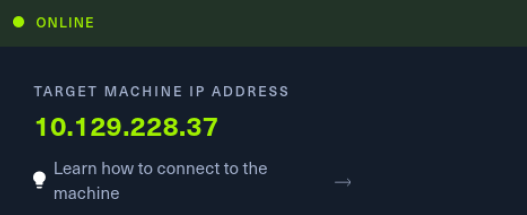
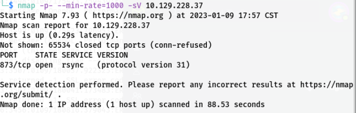
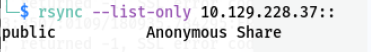
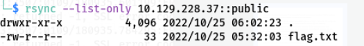
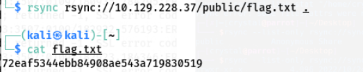

# 7x11 HTB系列——rsync未授权访问

## 信息收集

1. 打开HTB，启动靶机，目标IP如下

   

2. 扫描端口

   

3. 发现开放了873端口，对应服务为rsync

## 漏洞利用

1. 尝试连接rsync服务

   

2. 发现rsync的public目录允许匿名访问，查看该目录下的文件

   

3. 发现flag.txt文件，获取文件内容

   

4. 成功获取flag