# 7x18 HTB系列——[Base]目录遍历与认证绕过

## 信息收集

1. 端口扫描，开放了22、53、80端口，80端口有web服务，中间件为Apache 2.4.29，系统为Ubuntu

   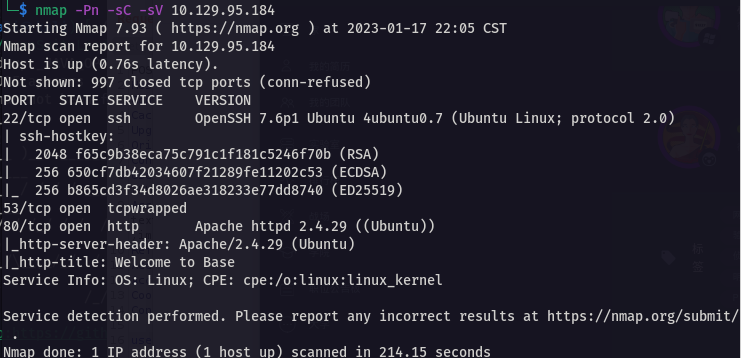

2. 访问IP，进入了一个网站界面，中间件为Apache 2.4.29，系统为Ubuntu

   

   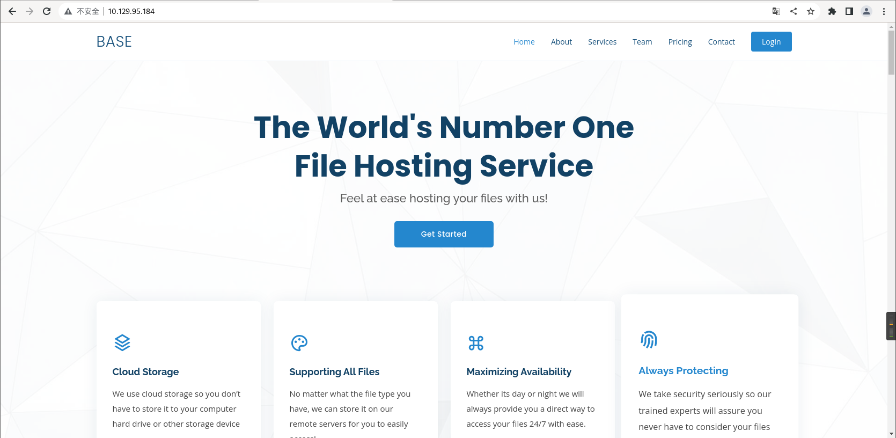

3. 有一个登录选项，点击登录，跳转到了http://10.129.95.184/login/login.php，网站语言为PHP，去掉后面的login.php，再访问，发现存在目录遍历漏洞，有config.php、login.php.swp两个敏感文件，但是只有login.php.swp这个交换文件可以下载

   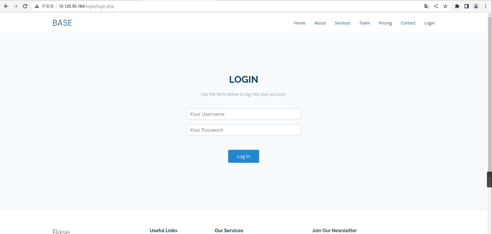

   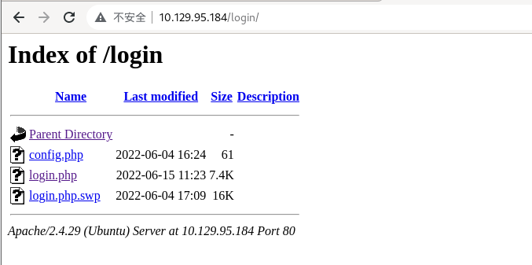

4. 下载login.php.swp到本地，使用vim打开该文件，看到源码中有登录验证的逻辑代码

   ```shell
   vim -r login.php.swp
   ```

   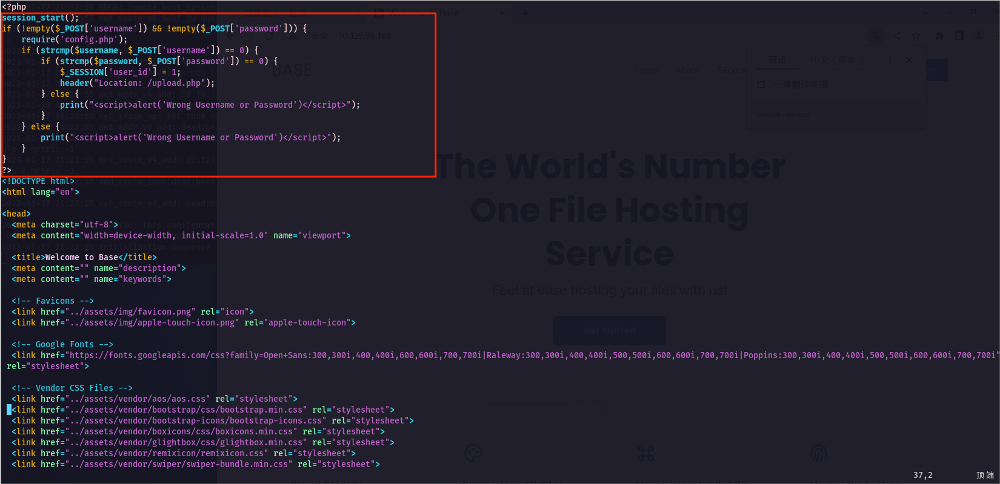

5. 使用srings命令输出swp文件中的全部可打印字符，发现网站的绝对路径

   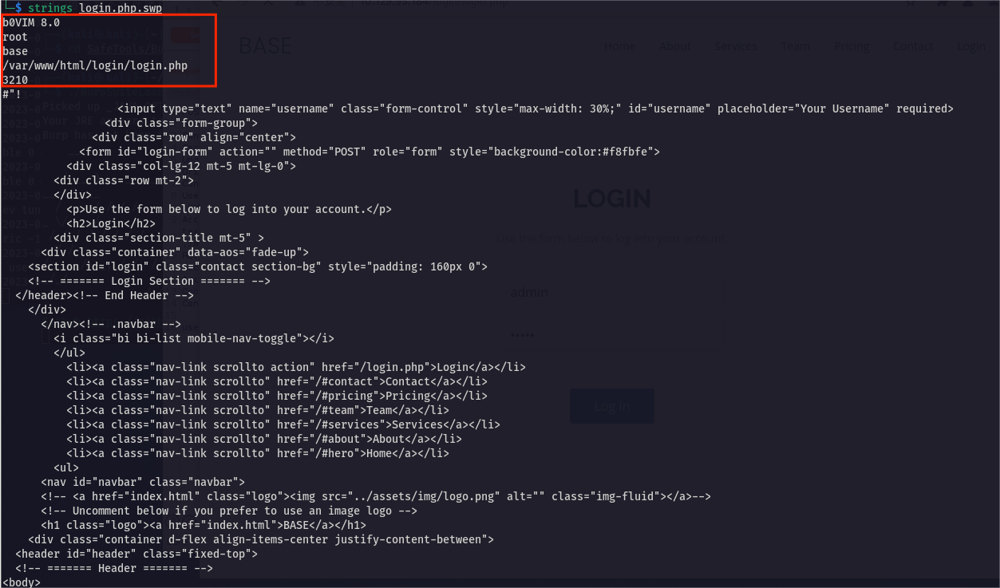

6. 回到上面获取到的那段php代码，通过post获取登录表单后，判断username和password不为空，再通过strcmp函数进行两次判断，判断username与password的值，判断通过后跳转到upload.php

   ``` php
   <?php
   session_start();
   if (!empty($_POST['username']) && !empty($_POST['password'])) {
       require('config.php');
       if (strcmp($username, $_POST['username']) == 0) {
           if (strcmp($password, $_POST['password']) == 0) {
               $_SESSION['user_id'] = 1;
               header("Location: /upload.php");
           } else {
               print("<script>alert('Wrong Username or Password')</script>");
           }
       } else {
           print("<script>alert('Wrong Username or Password')</script>");
       }
   }
   ?>
   ```

   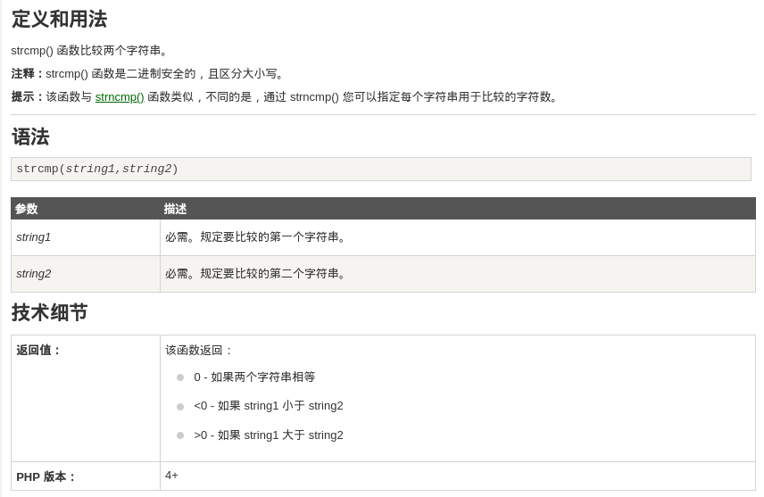

7. 网上搜索一下php strcmp绕过，strcmp比较的是字符串类型，如果传入其他类型的参数，则会出错并返回0，由此可以绕过该函数，从而绕过登录验证

   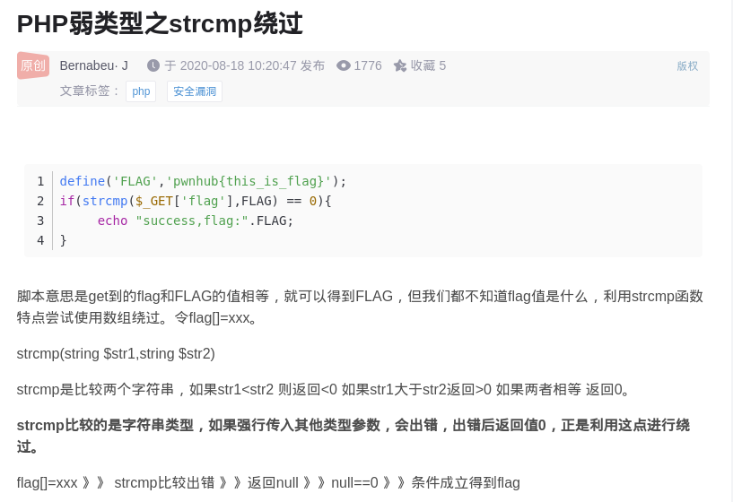

## 漏洞利用

1. 打开BurpSuite对登录页面进行抓包，修改username与password为如下格式

   ```html
   username[]=admin&password[]=pass
   ```

   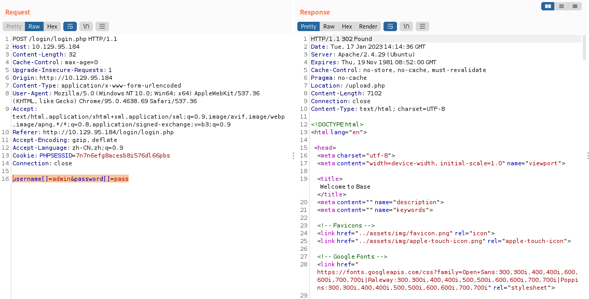

2. 成功绕过登录认证进入后台，后台是一个文件上传页面

   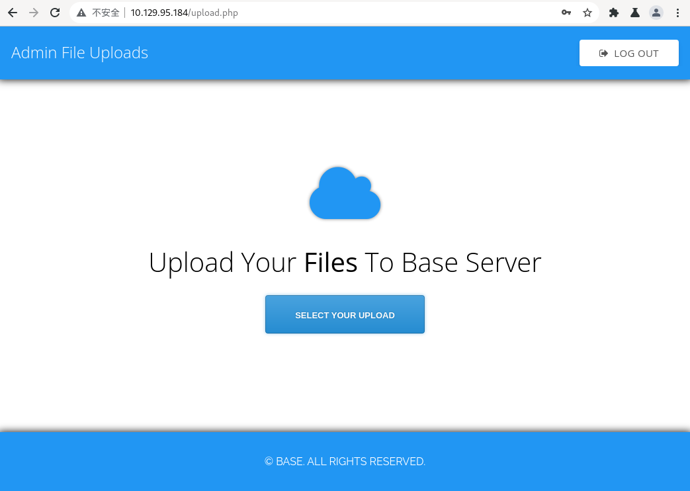

3. 尝试上传一个webshell，，没有文件校验，上传成功

   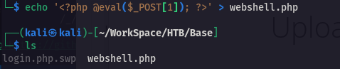

   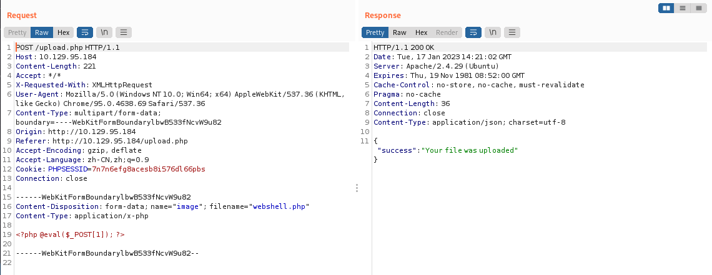

4. 爆破一下webshell文件的路径，发现一个_uploaded目录，访问一下

   ```shell
   gobuster dir --url http://10.129.95.184/ --wordlist /usr/share/wordlists/dirb/big.txt
   ```

   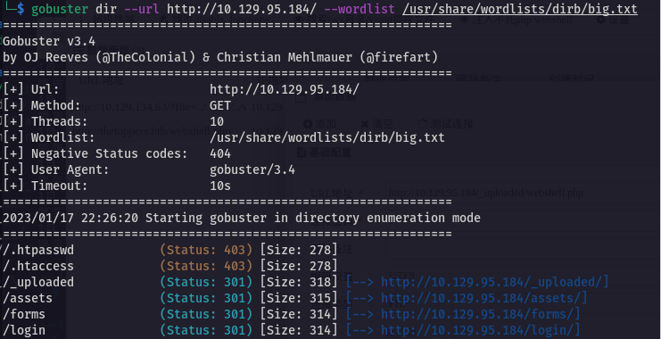

5. 又是一个目录遍历，_uploaded目录下发现webshell文件

   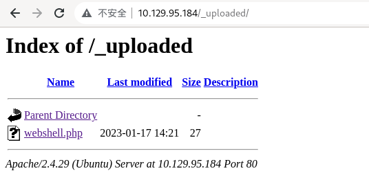

6. 尝试使用蚁剑进行连接，成功获取到webshell

   

7. 在/home/john下找到user.txt，但是需要john用户才可以查看

   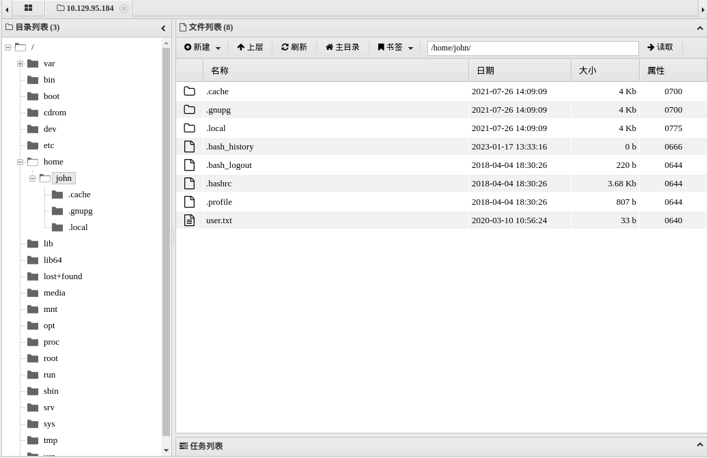

## 权限提升

1. 读取前面找到的config.php，成功获取管理员账号密码

   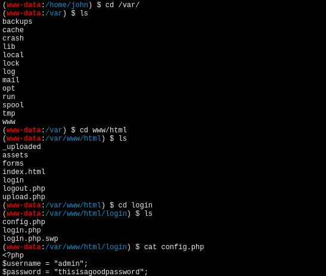

2. 尝试使用这个密码对john用户进行ssh登录，成功获取john用户的shell

   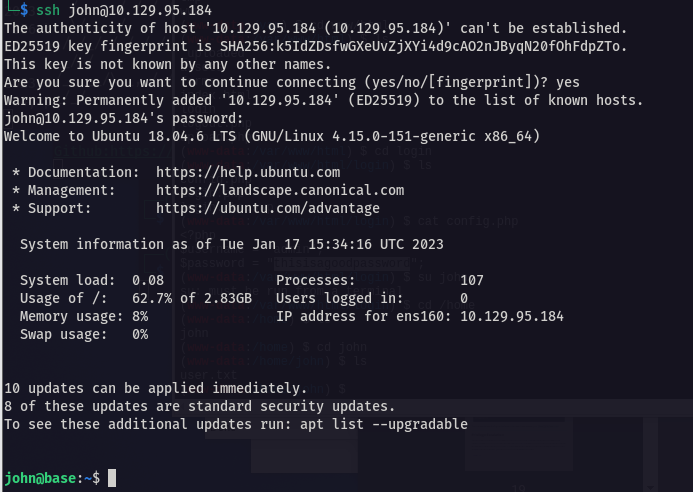

3. sudo -l查看提权信息

   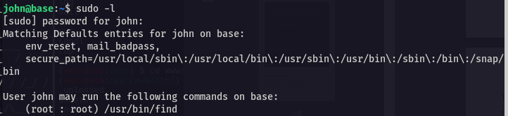

4. 发现可以通过find以root权限执行命令，执行以下命令获取root权限

   ```shell
   sudo find . -exec /bin/sh \; -quit
   ```

   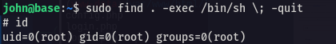

5. 成功获取root权限，在root目录下找到root.txt

   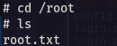