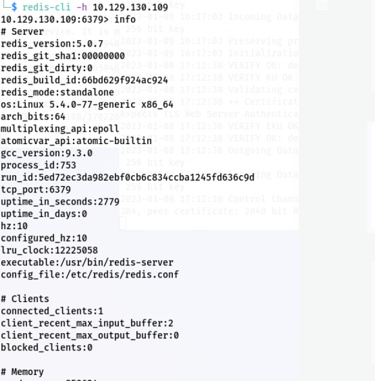

# 7x09 HTB系列——Redis

## 概述

1. 难易程度：简单
2. 学习Redis及其未授权访问漏洞的相关知识和技能

## 信息收集

1. 打开HTB，启动靶机，目标IP如下

   

2. 端口扫描，发现开放6379端口，开放服务为Redis，版本5.0.7

   

## 漏洞利用

1. 使用Redis工具redis-cli尝试连接

   ```shell
   redis-cli -h 10.129.130.109
   ```

   

2. 连接成功，存在redis未授权访问，执行info命令查看服务器信息，发现索引为0的数据库中存在4个键

   

3. 查看索引0中的键值

   

4. 使用get获取flag

   