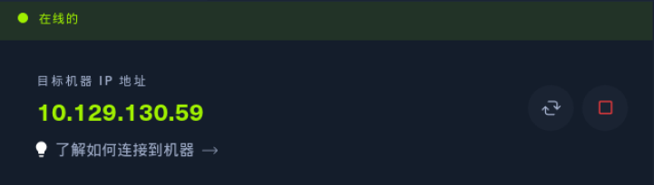
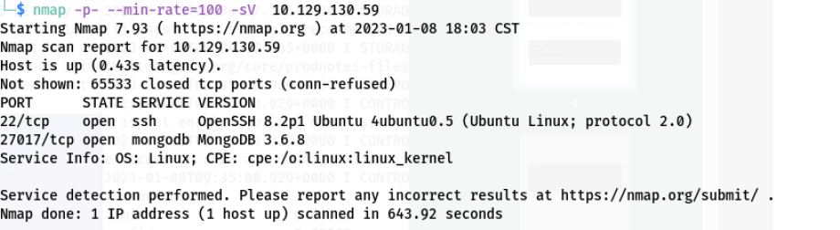
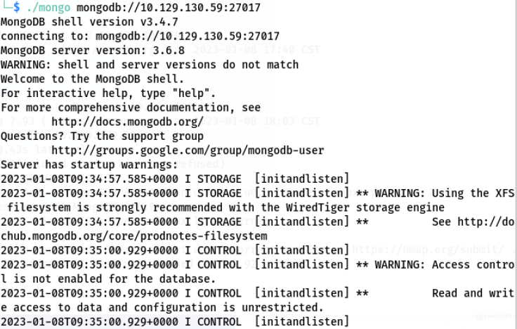
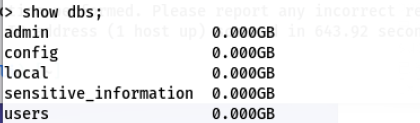
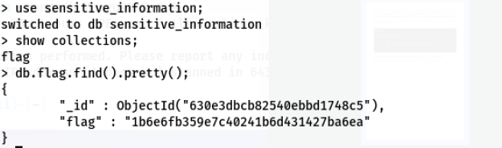

# 7x10 HTB系列——MongoDB

## 概述

1. 难易程度：简单
2. 学习MongoDB其未授权访问漏洞的相关知识和技能

## 信息收集

1. 打开HTB，启动靶机，目标IP如下

   

2. 扫描端口，发现开放了22端口和27017端口，对应服务为openssh和MongoDB

   

3. fscan扫描发现存在未授权访问漏洞

   


## 漏洞利用

1. 使用mongodb工具尝试连接

   

2. 连接成功，显示所有数据库

   

3. 查找flag，使用以下命令将flag数据转储为易于阅读的格式

   ```mongodb
   db.flag.find().pretty();
   ```

   

4. 成功获得flag