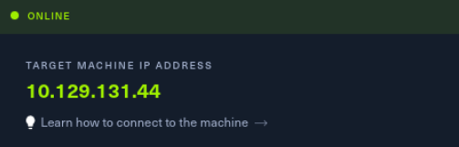
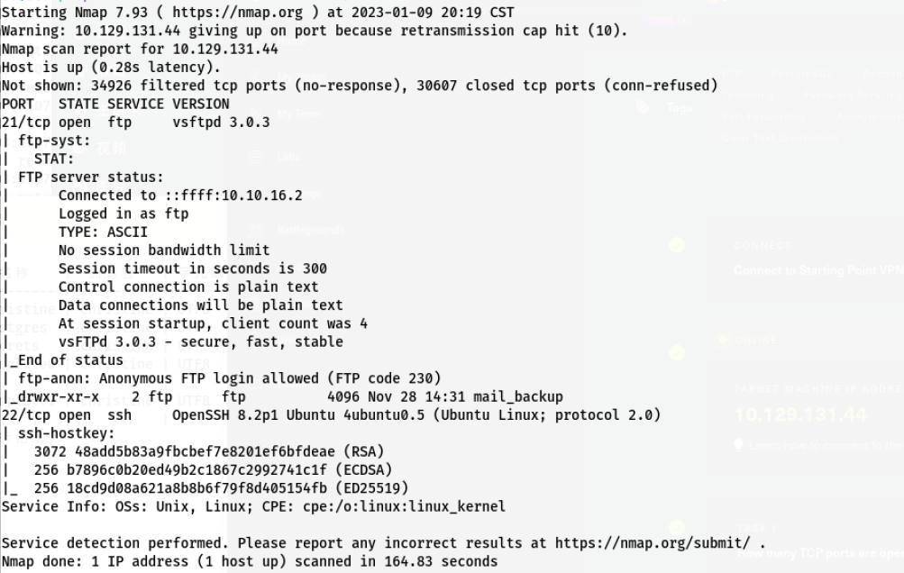
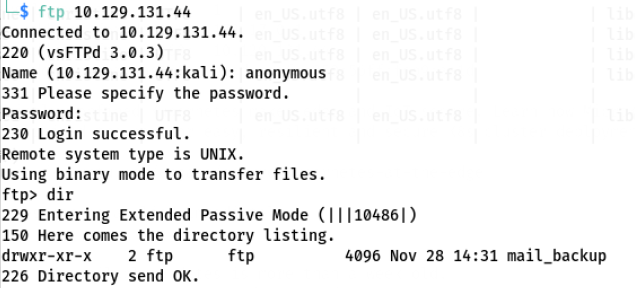
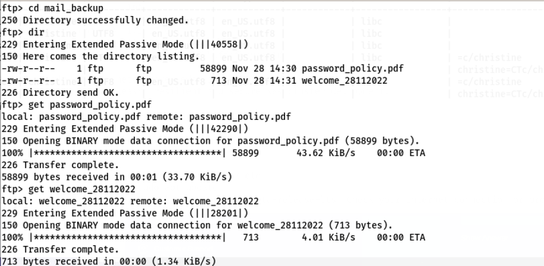
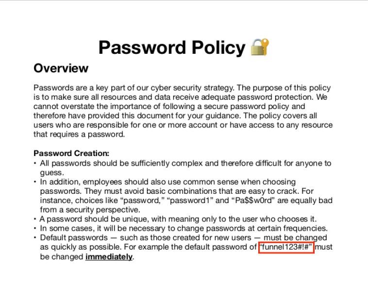
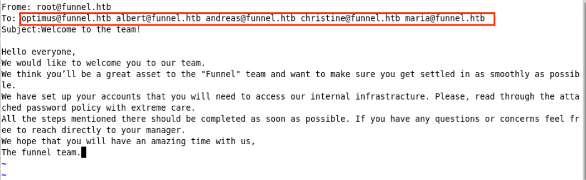
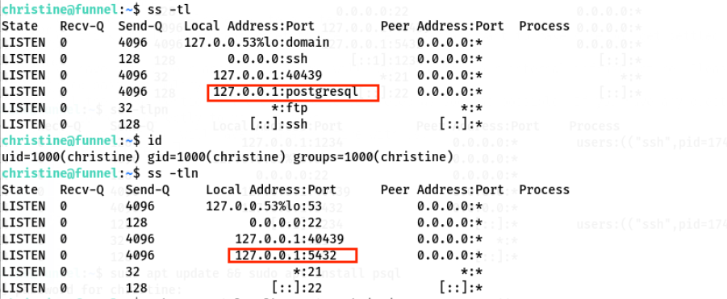
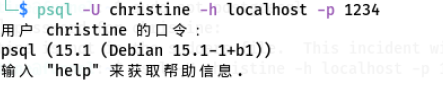
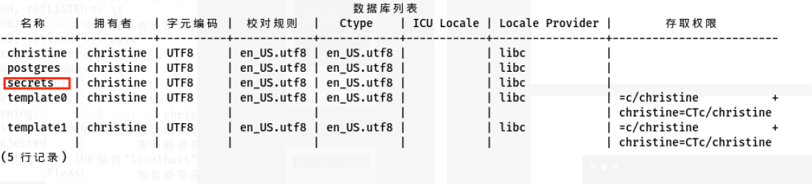
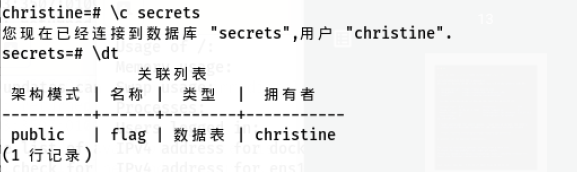

# 7x12HTB系列——funnel

## 信息收集

1. 启动靶机

   

2. 扫描端口

   

3. 开放了21端口和22端口，其中21端口允许ftp匿名访问

   


## 漏洞利用

1. 尝试匿名登录ftp成功，存在ftp未授权访问，dir发现ftp存在mail_backup目录，查看目录文件

   

2. 该目录下存在password_policy.pdf和welcome_28112022两个文件，get到本地，查看文件内容

   

   

3. 发现几个账户和一个密码，直接尝试ssh连接，发现christine用户可以使用密码funnel123#!#登录ssh，登录后查看一下端口进程

   

4. 发现目标主机本地端口5432由postgresql服务，但是在christine用户不能直接访问，且服务仅开放本地访问，使用ssh将postgresql转发到外部1234端口，注意，靶机和攻击机器都需要执行一次

   ```ssh
   ssh -L 1234:localhost:5432 christine@10.129.131.44
   ```

5. 攻击机器访问目标主机1234端口postgresql服务

   ```ssh
   psql -U christine -h localhost -p 1234
   ```

   

6. 成功登录postgresql，`\l`查看数据库列表，发现一个secrets

   

7. 使用`\c secrets`连接到secrets，使用`\dt`查看表列表，发现flag

   