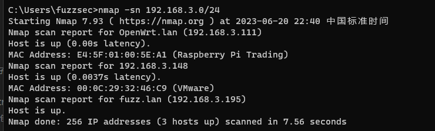
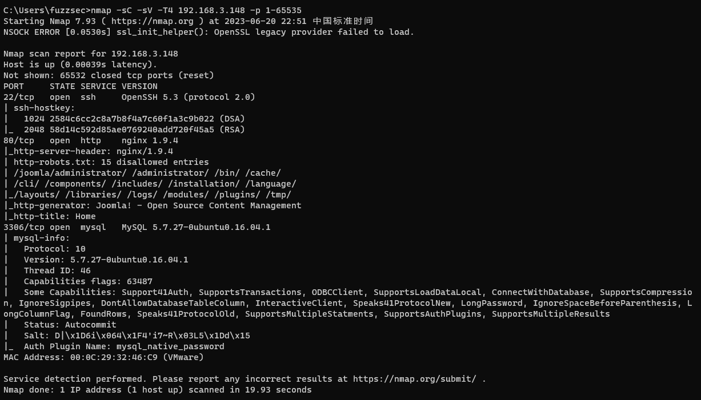
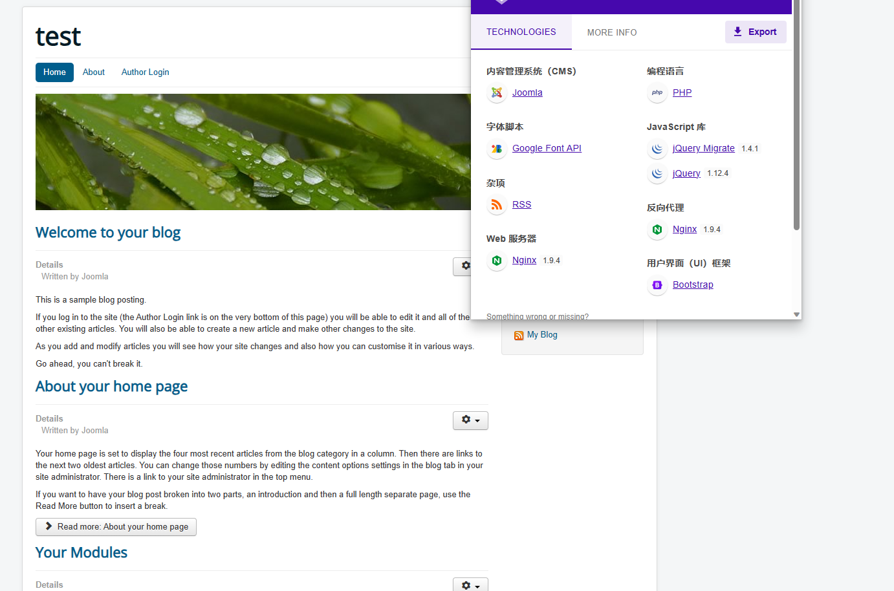
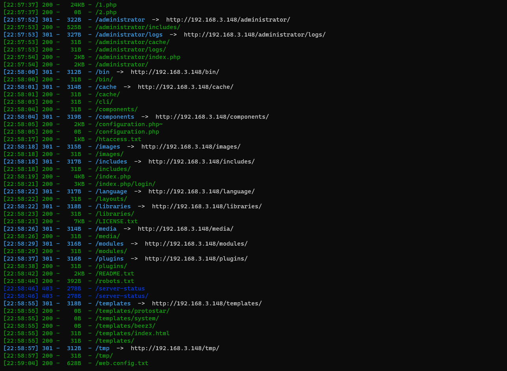
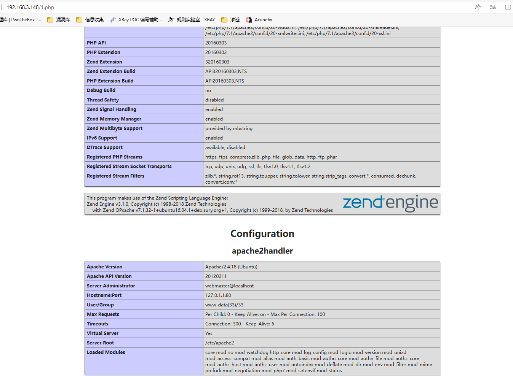
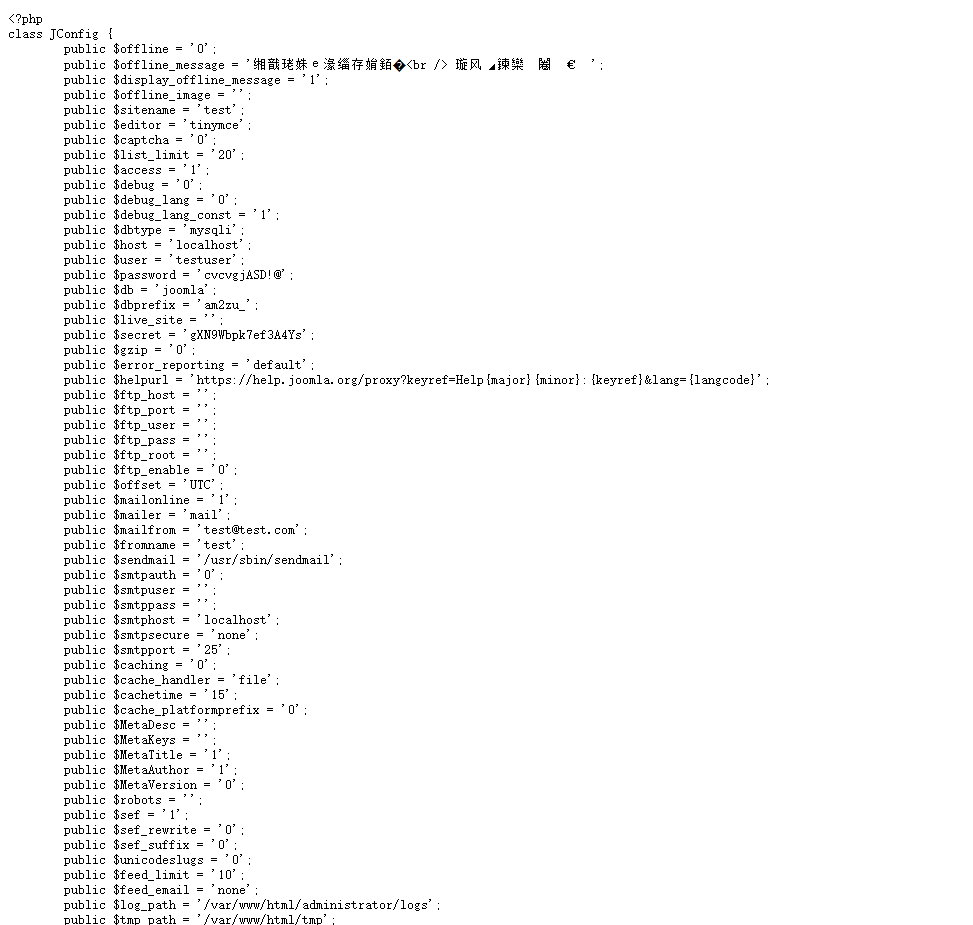
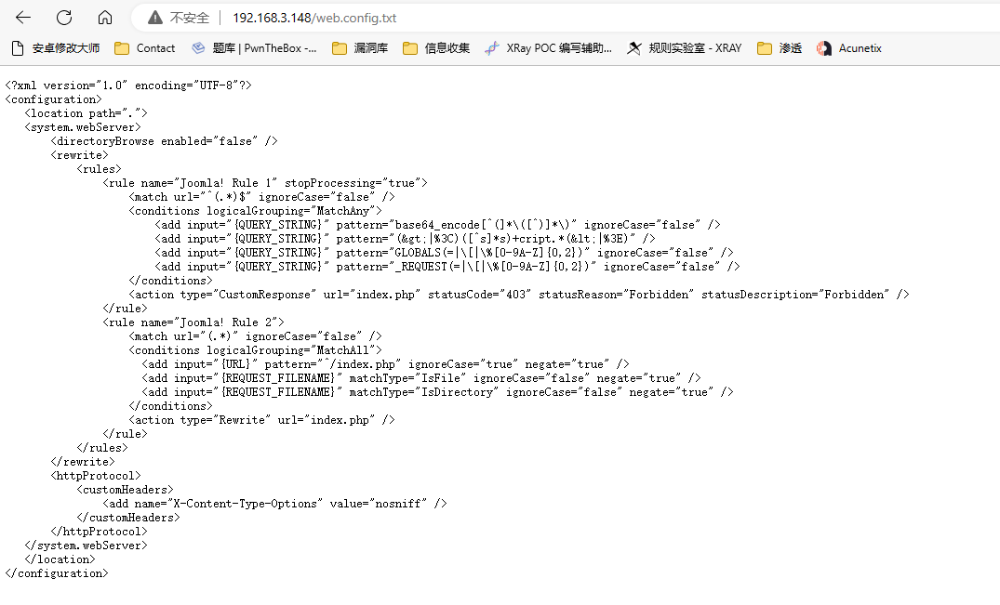
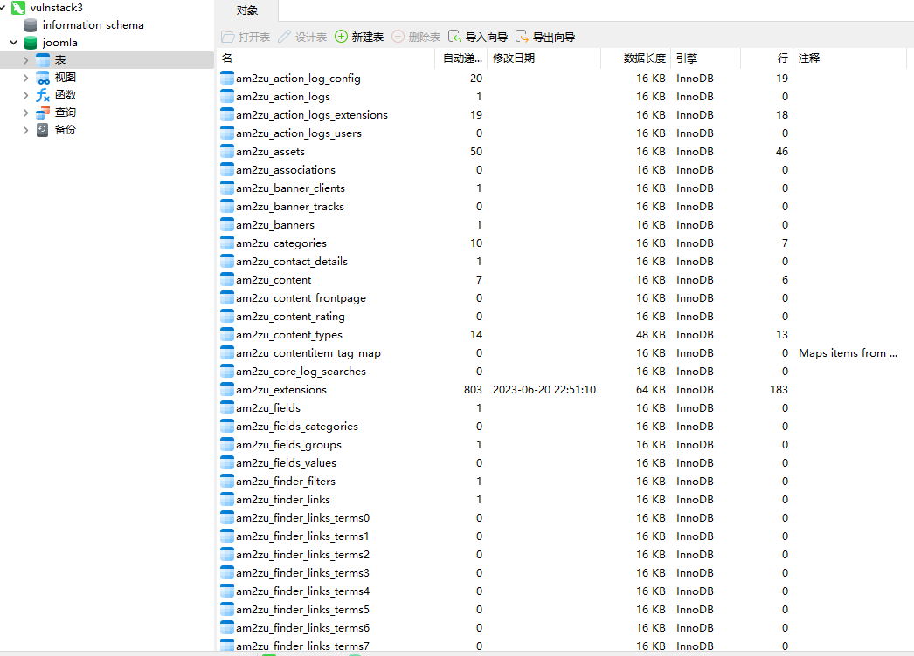

# 一、环境配置
1. 一共五台靶机，vmware中打开后先在web-centos中执行网卡重启命令重新获取ip，web-centos靶机是外网靶机
	``` shell
	service network restart
	```
# 二、信息收集
1. web-centos靶机的外网网卡是桥接模式的，获取ip后与本机是同一个网段，那么根据本机ip直接扫描c段即可发现web-centos
	``` shell
	nmap -sn 192.168.3.0/24
	```
2. 如下，192.168.3.0/24网段下存在3个ip，其中本机ip是192.168.3.195，192.168.3.111是我的软路由ip，那么另一个192.168.3.148就是web-centos的ip了
	
3. 扫描端口，如下，开放了3个端口，22、80、3306
	
4. 发现有web服务，看一下80端口的网站，如下，是Joomla CMS搭建的
	
5. 扫描一下目录，如下，后台为administrator
	
6. 访问一下1.php，发现是phpinfo，php版本为7.1
	
7. 查看configuration.php~，发现泄露了网站配置信息，用户名testuser，密码cvcvgjASD!@，这应该是数据库的用户名和密码
	
8. 还有一个web.config.txt
	
# 三、getshell
1. 先尝试用发现的用户名和密码连接数据库，如下，连接成功
	
2. 